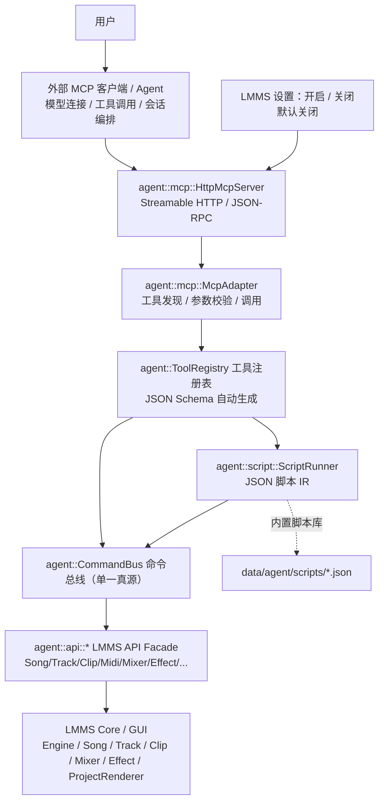
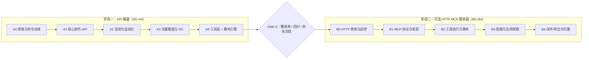

# LMMS Agent 支持计划书

> **文档状态**：v0.6（A0~A2 已补齐并验收，记录见 §10.2；阶段二仅保留可选启停的本机 HTTP MCP 服务器，范围精简见 §8.5）
> **编写日期**：2026-09-12（v0.6 修订：2026-10-03）
> **适用代码库**：LMMS 1.3.0-alpha（本工作区，分支 `master`）
> **勘察依据**：CodeGraph 符号级检索 + 源码核对（文中行号为编写时快照，可能随上游提交漂移）
> **目标一句话**：把 **LMMS 全部可操作 API** 封装成统一命令接口，供脚本调用，并通过**可选开启/关闭的 HTTP MCP 服务器**向外部 Agent 暴露工具；模型连接与会话编排由外部 MCP 客户端负责，LMMS 仅提供命令执行和服务管理。

---

## 目录

1. [背景与目标](#1-背景与目标)
2. [现状勘察结论](#2-现状勘察结论)
3. [总体架构设计](#3-总体架构设计)
4. [LMMS API 全量封装设计（核心）](#4-lmms-api-全量封装设计核心)
5. [工具调用层设计](#5-工具调用层设计)
6. [脚本引擎设计](#6-脚本引擎设计)
7. [HTTP MCP 服务器设计](#7-http-mcp-服务器设计)
8. [服务启停与配置设计](#8-服务启停与配置设计)
9. [操作正确性、事务与撤销](#9-操作正确性事务与撤销)
10. [实施里程碑（两大阶段）](#10-实施里程碑两大阶段)
11. [测试与验证](#11-测试与验证)
12. [风险与对策](#12-风险与对策)
13. [附录](#13-附录)

---

## 1. 背景与目标

### 1.1 背景

LMMS 是成熟的跨平台自由音乐制作软件（Qt Widgets + 自研音频引擎）。当前所有编辑操作都依赖图形界面（Song Editor、Piano Roll、B&B Editor、Mixer、Automation Editor），**没有对外的程序化接口**：外部脚本无法建轨、批量写 MIDI、驱动混音或导出。任何"AI 辅助编曲"都只能靠模拟点击，脆弱且不可复用。

### 1.2 目标

为 LMMS 建立 **Agent API 子系统**，以本地脚本和可选 HTTP MCP 服务提供能力，实现：

| # | 目标 | 说明 |
|---|------|------|
| G1 | **全量 API 封装** | 把 LMMS 全部可操作对象（工程、轨道、Clip、音符、自动化、Pattern/B&B、混音、效果器、乐器、控制器、导入导出……）封装为统一的、可 JSON 序列化的**命令接口**——"实现 LMMS 所有可用 API，方便脚本调用" |
| G2 | **工具调用** | 同一命令集自动生成 MCP 工具定义（JSON Schema），外部 Agent 可以检索工程、批量编辑、导出试听 |
| G3 | **脚本执行** | 提供确定性 **脚本引擎**（JSON 脚本 IR：变量/循环/条件/随机），供模型与用户编写可复现的编曲宏（鼓组、和弦进行、琶音、人性化、段落复制……） |
| G4 | **可选 HTTP MCP 服务** | 提供 HTTP MCP 端点与设置中的启停开关；运行时默认关闭，开启后供外部 MCP 客户端连接，关闭后释放监听端口 |

> 交付按**两大阶段**推进：**阶段一 = API 暴露**（命令总线 / 工具定义 / 脚本引擎，不依赖网络与 UI）→ **阶段二 = 可选 HTTP MCP 服务器**（协议适配 / HTTP 传输 / 启停与连接配置）；阶段二只消费阶段一产物、不修改命令语义。详见 §10。

### 1.3 非目标（首期不做）

- 不做云端账号 / 多用户协作；
- 不做 LMMS 内置聊天窗口、LLM 客户端、模型选择或 Agent 对话循环；这些由外部 MCP 客户端负责；
- 不做音频生成模型本身（人声合成、音频续写），只做 **LMMS 内操作编排**；
- 不改动音频渲染核心算法（DSP、时钟、缓冲管理）；
- 不追求"像素级 GUI 自动化"，所有操作一律走内部对象 API。

---

## 2. 现状勘察结论

> 以下均为 CodeGraph 精确检索 + 关键文件核对结果，作为后续设计的"事实基线"。

### 2.1 应用与窗口体系

| 项 | 结论 |
|----|------|
| 入口 | `src/core/main.cpp` → `lmms::MainApplication`（`include/MainApplication.h:45`，继承 `QApplication`） |
| GUI 初始化 | `gui::GuiApplication`（`src/gui/GuiApplication.cpp:89`）依次创建 `MainWindow`、`SongEditorWindow`、`MixerView`、`ControllerRackView`、`ProjectNotes`、`MicrotunerConfig`、`PatternEditorWindow`、`PianoRollWindow`、`AutomationEditorWindow`（GuiApplication.cpp:158~193），最后 `MainWindow::finalize()` |
| 窗口模型 | `MainWindow : QMainWindow`，中央区为 `QMdiArea`（`workspace()`）；`MainWindow::addWindowedWidget()`（`src/gui/MainWindow.cpp:539`）把窗口包装成 `gui::SubWindow` 放入 MDI 工作区。**没有 QDockWidget** |
| 窗口开关 | 工具栏按钮 + 快捷键（`MainWindow.cpp:440~462`）：Song Editor、Piano Roll、Automation、Mixer、Controller Rack、Project Notes（Ctrl+7 为 Project Notes）；对应 slot `toggleSongEditorWin()/togglePianoRollWin()/toggleAutomationEditorWin()/toggleMixerWin()/toggleControllerRack()/toggleProjectNotesWin()` |
| 服务配置接入 | 阶段二沿用 LMMS 现有设置体系添加服务控制与连接状态；无需仿照 `ProjectNotes` 新建 Agent 窗口或保存会话到工程 |
| 编辑器基类 | `Editor`（`include/Editor.h:45`）：带播放/录制工具栏的编辑器基类（Song Editor / Automation Editor / B&B Editor / Piano Roll） |

### 2.2 核心对象模型

| 域 | 关键结论 |
|----|----------|
| 引擎单例 | `Engine`（`include/Engine.h:51`）：`audioEngine() / mixer() / getSong() / patternStore() / projectJournal()`、`framesPerTick()`；`Engine::init(false)` 由 GuiApplication 调用 |
| 音频引擎 | `AudioEngine`（`src/core/AudioEngine.cpp:67`）：缓冲、采样率、worker 线程；编辑期间用 `requestChangeInModel()/doneChangeInModel()` 与音频线程协调（例：`Clip::movePosition`，`src/core/Clip.cpp:95`） |
| 工程 `Song` | `src/core/Song.cpp:67`、`include/Song.h:64`。模型：`m_tempoModel / m_timeSigModel / m_masterVolumeModel / m_masterPitchModel`；`PlayMode{None,Song,Pattern,MidiClip,AutomationClip}` 各带一个 `Timeline`；传输：`play()/stop()/togglePause()/setPlayPos()`；文件：`loadProject()/saveProjectFile()/clearProject()`；全局自动化轨 `globalAutomationTrack()`；音阶 `m_scales/m_keymaps`（`Scale/Keymap`）；导出状态 `isExporting()/getExportProgress()/isExportDone()/setExportLoop()/setRenderBetweenMarkers()` |
| 轨道 `Track` | `include/Track.h:67`：`Type{Instrument, Pattern, Sample, Event, Video, Automation, HiddenAutomation}`；工厂 `Track::create(Type, TrackContainer*)`（:101）、`clone()`；`isMuted/isSolo`、`addClip/removeClip/getClips`；容器 `TrackContainer::addTrack`（`src/core/TrackContainer.cpp:177`） |
| Clip 族 | `Clip`（`src/core/Clip.cpp:41`）：`movePosition()/changeLength()/isMuted()/setAutoResize()/setStartTimeOffset()/setColor()`；派生 `MidiClip`（`src/tracks/MidiClip.cpp:42`，`addNote()` :180、`m_notes`、`m_steps`）、`SampleClip`（`src/core/SampleClip.cpp:39`，`setSampleFile()` :154、reversed、帧偏移）、`AutomationClip`（`src/core/AutomationClip.cpp:48`）、`PatternClip`（歌曲中引用 PatternStore，见 `TrackContainer.cpp:319`） |
| 自动化 | `AutomationClip`：`timeMap`（`QMap<int, AutomationNode>`）、`addObject(AutomatableModel*)`、`putValue()/putValues()/removeNode()/removeNodes()`、`setProgressionType()`（`ProgressionType`，含 `CubicHermite`）、`valueAt()`；基础设施 `AutomatableModel`、`TrackContainer::automatedValuesFromTracks()`（`src/core/TrackContainer.cpp:267`） |
| 音符 | `Note`（`src/core/Note.cpp:37`）：pos / length / key / volume / panning / detuning（`DetuningHelper`）/ `Type::Step` |
| Pattern / B&B | `PatternStore`（`include/PatternStore.h:67`）：`lengthOfPattern()/numOfPatterns()/removePattern()/swapPattern()/createClipsForPattern()/currentPattern`；`PatternTrack`（`include/PatternTrack.h:46`）：`patternIndex()/findPatternTrack()/swapPatternTracks()` |
| 混音 | `Mixer` / `MixerChannel`（`src/core/Mixer.cpp:62`）：`m_fxChain`、`volume/mute/solo/name/color`、`m_sends/m_receives`（`MixerRoute`）；`clearChannel()`（:759）、`createChannelSend()/deleteChannelSend()` |
| 效果器 | `Effect`（`src/core/Effect.cpp:41`）：`enabled/wetDry`、`controls()`、`Effect::instantiate(name, parent, key)`（:151）；`EffectChain`（append/clear）；插件发现 `PluginFactory`（`src/core/PluginFactory.cpp:56`：`discoverPlugins()/pluginInfo()/errorString()`）；`Plugin::instantiate()`（`src/core/Plugin.cpp:208`） |
| 效果参数 | `EffectControls`（`include/EffectControls.h:43`）**仅有 `controlCount()`**；各参数以具名子模型参与 `saveSettings/loadSettings`（`Effect::saveSettings`，`src/core/Effect.cpp:61~90`）——通用参数通道先基于该序列化实现（见 §4.5） |
| 乐器 | `InstrumentTrack`（`src/tracks/InstrumentTrack.cpp:49`）：volume/panning/pitch/pitchRange/baseNote/mixerChannel 模型、`m_midiPort`、`m_soundShaping/m_arpeggio/m_noteStacking/m_piano`；`loadInstrument()`（:1040，已有 7 处调用：MidiImport、HydrogenImport、FileBrowser 等） |
| 工程 I/O | `DataFile`（`src/core/DataFile.cpp:127`，XML + `upgrade()` 版本迁移）；`SerializingObject` / `JournallingObject`；撤销 `ProjectJournal`（`include/ProjectJournal.h:38`）：`undo()/redo()/canUndo()/canRedo()/addJournalCheckPoint()/clearJournal()` |
| 导出 | `ProjectRenderer`（`src/core/ProjectRenderer.cpp:78`，`QThread` + `OutputSettings` + `ExportFileFormat`）；GUI 侧 `ExportProjectDialog`；**已有插件**：`plugins/MidiExport`、`plugins/MidiImport`、`plugins/HydrogenImport` |
| 时间 | `TimePos`（`include/TimePos.h:38`）：`DefaultTicksPerBar=192`、`DefaultStepsPerBar=16`、`ticksPerBar()/stepsPerBar()/stepPosition()/fromFrames()` |
| 循环标记 | **试听循环点当前由 GUI 持有**：`gui::TimeLineWidget`（`include/TimeLineWidget.h:234` `m_oldLoopPos`、`MoveLoopBegin` 等）；核心只存导出循环 `Song::m_exportLoopBegin/End`。Agent 的 loop 命令需要先做核心层桥接（见 §4.4） |
| GUI 访问 | `gui::getGUI()`（`include/GuiApplication.h:111`）；访问器 `mainWindow()/songEditor()/mixerView()/patternEditor()/pianoRoll()/automationEditor()/getControllerRackView()/getProjectNotes()`（:74~82） |
| 构建 | `CMakeLists.txt:278`：Qt 组件 `Core Gui Widgets Xml Svg`；Qt 最低 5.15（`WANT_QT6` 可切 6.x，:265~274）；源文件按目录登记（如 `src/gui/CMakeLists.txt` 中 `gui/ProjectNotes.cpp`）；测试 `tests/CMakeLists.txt`（QTest，`LMMS_TESTS` 列表） |

### 2.3 现有能力缺口（本计划要补的）

1. **本机 MCP 传输待实现**：仅在阶段二按需引入 `Qt::Network` 实现回环 HTTP 监听；不补建通用联网设施、模型请求客户端或云服务连接层。
2. **无内嵌脚本引擎**：采用自研 JSON 脚本 IR（零依赖），不新增 JS VM 绑定。
3. **勘察时无 Agent API / MCP 服务**：阶段一新增 `src/agent/`（A0/A1/A2 进展见 §10.2），阶段二新增 HTTP MCP 适配与服务启停设置。
4. **通用参数枚举缺失**：`EffectControls` 只有 `controlCount()`，无 `paramAt(i)`；`Model` 只有 `parentModel()`，无子节点枚举 → 先用 XML 序列化通道，后补反射接口（§4.5）。
5. **循环标记不在核心模型**：需把循环起止点抽到 `Song`/`Timeline` 层或经 GUI 桥接（§4.4）。
6. **Pattern/B&B 创建流程偏向 GUI**：`PatternEditor` 负责"新建 pattern"；需封装等价的核心路径（`Track::create(Type::Pattern, Engine::patternStore())` 等）。

---

## 3. 总体架构设计

### 3.1 分层



**关键设计决策——单一真源（Single Source of Truth）**：
所有能力只实现一次（`CommandBus` 命令），由它**派生**：

- MCP 工具定义（JSON Schema）；
- 脚本引擎的命令目录与帮助；
- 未来的命令行/自动化测试入口；
- 自动生成的 API 文档。

### 3.2 线程模型

| 组件 | 线程 | 规则 |
|------|------|------|
| CommandBus / Facade | **GUI 主线程** | 所有模型访问在主线程执行；HTTP 请求通过队列派发并异步接收结果，停服期间不阻塞等待主线程 |
| 音频同步 | 主线程 | 结构性修改包裹 `AudioEngine::requestChangeInModel()/doneChangeInModel()`（与现有 `Clip::movePosition` 等一致） |
| HTTP MCP 网络 | Qt 事件循环 | HTTP 收发与协议解析异步执行；不得在网络处理路径直接访问 LMMS 模型 |
| 长任务（导出/导入） | 既有机制 | `ProjectRenderer` 本身是 `QThread`；进度经 `Song::getExportProgress()` 轮询或信号；可取消 |
| 脚本引擎 | GUI 主线程 | 顺序执行命令；执行结果与任务状态交给 MCP 适配层 |

### 3.3 目录规划（新增）

```
include/agent/                 # 公开头文件
  CommandBus.h  ToolRegistry.h  ...
  api/                         # 各域 Facade 头
  script/ScriptRunner.h
  mcp/HttpMcpServer.h  mcp/McpAdapter.h
src/agent/
  api/                         # Facade + CommandBus 实现
  script/                      # 脚本引擎
  mcp/                         # HTTP 传输、MCP 协议适配、服务生命周期
  tools/                       # 工具注册、schema 生成
src/gui/agent/                 # MCP 服务设置与状态显示
data/agent/scripts/*.json      # 内置编曲脚本库
tests/src/agent/*.cpp          # QTest 单元测试
```

CMake：阶段一 `WANT_AGENT` 开关的描述统一为 `Include Agent command API`。阶段二新增 `OPTION(WANT_AGENT_MCP "Include HTTP MCP server" ON)`，依赖 `WANT_AGENT`。仅启用 `WANT_AGENT_MCP` 时引入 Qt `Network` 与 MCP 服务源文件；关闭该构建开关仍可使用阶段一 API/脚本。HTTP 实现需兼容 Qt5.15/Qt6，不能强制依赖仅 Qt6 提供的 HTTP Server 模块。运行时启停独立于构建开关，详见 §8。

---

## 4. LMMS API 全量封装设计（核心）

> 本节回答需求中的 **"要实现 LMMS 所有可用 API，方便脚本调用"**。

### 4.1 设计原则

1. **一切皆命令**：每个 API = 一个具名命令 + JSON 参数 + JSON 结果，纯数据、可序列化、可回放。
2. **读改分离**：描述符声明只读或变更；`query.*` 为只读查询，工程变更使用事务，播放与文件输出按各自副作用处理。
3. **变更可撤销**：所有写命令经 `ProjectJournal` checkpoint 包裹；一个"批次"= 一次撤销单位。
4. **可预览（dryRun）**：写命令支持 `dryRun:true`，返回"将发生什么"的结构化 diff。
5. **稳定命名**：`域.动作`（如 `midi.addNotes`），命名一旦发布即冻结，供模型/脚本长期记忆。
6. **幂等优先**：如 `track.setMute` 幂等；`midi.addNotes` 返回生成的音符 ID 以支持后续修改。
7. **GUI 联动可选**：命令默认直接操作模型（视图自动刷新），不依赖窗口是否打开。

### 4.2 命令描述符与命令总线

```cpp
namespace lmms::agent {

enum class Mutability { ReadOnly, Mutating, Destructive };   // Destructive：删除/清空/覆盖文件
enum class TxScope    { None, Single, Batch };               // 撤销粒度

struct CommandDescriptor {
    QString      name;         // "midi.addNotes"
    QString      summary;      // 一句话说明（MCP 工具描述与本地帮助）
    QJsonObject  argsSchema;   // JSON Schema（生成 MCP 工具定义 / 脚本校验 / 文档）
    Mutability   mutability;
    TxScope      scope;
    std::function<CommandResult(const QJsonObject& args)> handler;
};

class CommandBus {
public:
    static CommandBus& instance();
    CommandResult execute(const QString& name, const QJsonObject& args); // 主线程
    QList<CommandDescriptor> descriptors() const;                        // 供 ToolRegistry / 文档
    void beginBatch(const QString& label);   // 内部：addJournalCheckPoint
    void endBatch(bool success);             // 失败自动回滚（undo 到批次前）
};
} // namespace lmms::agent
```

`CommandResult` 统一为 `{ "ok": bool, "data": {...}, "error": {"code","message","hint"} }`。

### 4.3 域与映射总表（"所有可用 API"清单）

| 域（前缀） | 覆盖的 LMMS 内部 API 锚点 | 代表命令 |
|-----------|--------------------------|----------|
| `song.*` | `Song`（tempo/timeSig/master vol/pitch/PlayMode/clear/load/save）、`DataFile` | `song.setTempo` `song.load` `song.clearProject` |
| `transport.*` | `Song::play/stop/togglePause`、`Timeline`、循环标记（§4.4 桥接） | `transport.play` `transport.setLoopRange` |
| `track.*` | `Track::create/clone`、`TrackContainer::addTrack/removeTrack`、`Track` 通用属性 | `track.create` `track.setSolo` |
| `instrument.*` | `InstrumentTrack` 全部模型、`loadInstrument()`、MIDI 端口、`InstrumentSoundShaping/Arpeggio/NoteStacking/Piano` | `instrument.load` `instrument.setVolume` |
| `clip.*` | `Clip` 通用（位置/长度/静音/颜色/autoResize/偏移） | `clip.create` `clip.resize` |
| `midi.*` | `MidiClip`（`addNote()/notes()`）、`Note`、步进音符、量化 | `midi.addNotes` `midi.quantize` |
| `sample.*` | `SampleClip::setSampleFile()`、reversed、帧偏移、`SampleBuffer` | `sample.setFile` `sample.setReversed` |
| `pattern.*` | `PatternStore`、`PatternTrack`、`PatternClip` | `pattern.create` `pattern.placeInSong` |
| `automation.*` | `AutomationTrack`、`AutomationClip`（`putValue/removeNode/addObject/setProgressionType`）、`AutomatableModel` | `automation.putValue` `automation.addTarget` |
| `model.*` | `AutomatableModel` 通用读写（按路径寻址） | `model.getValue` `model.setValue` |
| `mixer.*` | `Mixer`、`MixerChannel`、`MixerRoute`（send/receive）、master | `mixer.setVolume` `mixer.addSend` |
| `effect.*` | `EffectChain`、`Effect::instantiate`、`EffectControls` | `effect.add` `effect.setParam` |
| `controller.*` | `Controller` 族（LFO/Peak/MIDI/…）、`ControllerConnection` | `controller.add` `controller.connect` |
| `scale.*` | `Song` 的 `Scale/Keymap`、微调音 | `scale.set` `scale.snapNotes` |
| `history.*` | `ProjectJournal` | `history.undo` `history.redo` |
| `export.*` | `ProjectRenderer`、`OutputSettings`、`MidiExport` | `export.audio` `export.midi` |
| `import.*` | `MidiImport`、`HydrogenImport`、采样导入路径 | `import.midi` `import.sampleToTrack` |
| `query.*` | 全模型只读摘要（供调用方查询） | `query.songSummary` `query.trackDetail` |
| `config.*` | `ConfigManager` | `config.get` `config.set` |
| `compose.*` / `edit.*` / `mix.*` | **高层组合命令**（内部即预置脚本，见 §5.3） | `compose.chordProgression` `edit.humanize` |

完整命令清单见 [附录 C](#附录-c完整命令清单)。

### 4.4 稳定寻址方案（外部客户端与脚本共用）

- 轨道参数接受容器内索引、唯一名称（如 `Lead Synth`），或查询返回的 `song/track:<i>` / `pattern/track:<i>` 路径；`parent` 默认 `song`，路径携带容器。名称重复时必须使用索引或路径；编辑后由 `query.*` 刷新。
- Clip 参数接受轨道内索引；查询返回 `song/track:<i>/clip:<j>` 或 `pattern/track:<i>/clip:<j>` 路径。路径与索引随当前排序更新，不作为永久 ID。
- 混音通道：`channel:<0|master>`；效果槽：`channel:<n>/fx:<k>` 或 `track:<i>/fx:<k>`；
- 自动化目标（`AutomatableModel`）：**路径字符串**，如
  `song/track:3/instrument/volume`、`song/track:3/fx:0/wet`、`song/channel:2/volume`；
  实现方式：为各 Facade 域注册"模型路径解析器"，由 `model.*` 命令统一读写；
- **需要补齐的桥接（小改动，需上游友好）**：
  1. 循环标记模型化：把 `TimeLineWidget` 的 loop 起止点提升为 `Song`/`Timeline` 级模型（或提供 `SongEditor` 侧封装），使 `transport.setLoopRange` 与工程序列化一致；
  2. 效果参数枚举：见 §4.5；
  3. Pattern 创建核路径：`PatternStore` 增加等价于 PatternEditor "新建 pattern" 的方法（或 Facade 内复刻其步骤）；
  4. 选择状态 API（可选）：`SongEditor`/`PianoRoll` 的选区导出/导入，供"对选中片段操作"。

### 4.5 效果器/乐器参数枚举与设置（三级方案）

| 级别 | 方案 | 优点 | 缺点 | 采用阶段 |
|------|------|------|------|----------|
| L1 | **序列化通道**：临时 `QDomDocument` → `controls()->saveState(doc, elem)` → 遍历 XML 键值得到参数名/当前值；`setParam` 走 `loadSettings` 的等价流程 | 零侵入、对全部既有插件立即生效 | 无范围/类型/单位，值语义为原始值 | **A2**（随 `effect.*`/`instrument.*` 参数命令落地） |
| L2 | 为 `EffectControls` 与 `Instrument` 增加**可选接口**：`virtual QMap<QString, AutomatableModel*> parameterModels()`，键沿用原生存储名称；优先给自带效果与常用插件实现，未实现者回退 L1 | 有范围/类型/中心值、稳定模型路径，可校验与自动化 | 需逐个插件补实现 | A3~A4（覆盖审计阶段补齐常用插件） |
| L3 | 长期：把参数元数据注册进 `Plugin::Descriptor`（name/range/default/unit），生成参数 schema 与文档 | 统一元数据 | 上游工作量大 | 社区/后续版本，不属 MCP 交付要求 |

### 4.6 事务与撤销语义

- **单命令**（`TxScope::Single`）：执行前后各打一个 `ProjectJournal` checkpoint；失败即 `undo()` 回滚该命令。
- **批次**（`TxScope::Batch`，脚本与多工具调用共用）：一次 `beginBatch()` 只打一个 checkpoint；批次内任意命令失败 → 整体回滚；结果返回批次标识与撤销信息，供外部客户端展示。
- **回滚实现**：利用既有 `ProjectJournal::undo()` 循环到批次深度标记（需在 `ProjectJournal` 上增加轻量"批次深度查询/回滚到指定深度"辅助，或在 Agent 侧记录 undo 栈深并用 `canUndo()` 步进）。
- **诊断**：保留必要的错误与批次诊断；JSONL 审计和命令重放导出不作为首期要求。

### 4.7 命令示例

命令调用（外部客户端或本地脚本 → 命令总线）：

```json
{ "name": "track.create",
  "arguments": { "type": "Instrument", "name": "Lead Synth", "parent": "song" } }
```

返回：

```json
{ "ok": true, "data": { "index": 3, "path": "song/track:3" } }
```

自动化写值（路径寻址）：

```json
{ "name": "automation.addTarget", "arguments": {
    "track": 3, "clip": 0, "target": "song/track:3/instrument/volume",
    "nodes": [ { "pos": 0, "value": 0.6 }, { "pos": 672, "value": 1.0 } ] } }
```

---

## 5. 工具调用层设计

### 5.1 工具生成

`ToolRegistry` 直接遍历 `CommandBus::descriptors()`，生成 MCP 工具定义：

```json
{"name":"domain.action","description":"命令用途与参数说明","inputSchema":{}}
```

`summary` 与参数 `description` 应写清适用场景、参数语义和单位。工具目录由 `tools/list` 提供，执行由 `tools/call` 接入统一命令总线；不实现 OpenAI/Anthropic 专用格式、模型 HTTP 请求或厂商 SDK。

### 5.2 执行约束

LMMS 负责参数校验、主线程执行、失败回滚、撤销和明确错误。用户确认交互由外部 MCP 客户端负责，不新增 LMMS 审批面板、审批等待队列或审批超时状态机。命令描述符保留只读/修改/破坏性分类，供客户端判断操作影响；分类不代替参数校验。

导入/导出检查本地路径和文件状态；覆盖已有文件必须由调用方明确指定，不能默默覆盖。服务配置通过 LMMS 本地设置修改，不通过 MCP 工具改变服务自身的监听或连接配置。

### 5.3 高层编曲工具 = 预置脚本

为方便批量编曲，提供高层工具；**它们不重复实现**，而是执行内置脚本（§6），例如：

| 工具 | 行为（脚本组合） |
|------|------------------|
| `compose.chordProgression` | 建轨 → 按时值铺和弦音符（支持 `I-V-vi-IV`、`Am7` 等符号） → 可选转位/加转位音 |
| `compose.arpeggio` | 把指定 clip 的和弦展开为 1/8 或 1/16 琶音，可选模式（up/down/updown/random） |
| `compose.drumPattern` | 按风格模板（four_on_floor / trap / rock…）写 GM 鼓音符 |
| `compose.bassline` | 跟随和弦根音生成根音/八度律动；滑音和闷音取决于乐器，后续按需扩展 |
| `edit.humanize` | 对选区做时间/力度/微调抖动（带 `seed` 可复现） |
| `edit.quantize` | 网格量化（复用 `PianoRoll` 量化值域 `Quantizations[]`，`include/Editor.h:35`） |
| `arrange.duplicateSection` | 复制小节区间（含全部轨道裁剪/平移），生成 verse→chorus |
| `mix.gainStaging` | 使用调用方提供的实测 `peakDb`，按 `targetDb/headroomDb` 调整通道增益；首期不自动分析音频峰值 |
| `render.preview` | 渲染区间到临时 WAV，返回文件路径与任务状态，由调用方播放 |

### 5.4 脚本入口与可选辅助工具

`agent.runScript(script)` 提供脚本执行，使用 `dryRun:true` 返回批量预览。`agent.diffPreview(commands)` 可作为本地包装。MCP 工具目录统一使用 `tools/list`；`agent.listCommands/searchCommands/commandHelp` 仅作为可选本地辅助接口，不列为 MCP 首期必需工具。`agent.getContext` 可由现有 `query.*` 组合替代。

---

## 6. 脚本引擎设计

### 6.1 JSON 脚本 IR

```json
{
  "name": "four_on_floor",
  "vars": { "kick": 36, "snare": 38 },
  "steps": [
    { "let": "drums", "cmd": "track.create",
      "args": { "type": "Instrument", "name": "Drums", "parent": "song" } },
    { "let": "clip", "cmd": "clip.create",
      "args": { "track": "$drums.index", "position": "bar:0", "length": "bar:4" } },
    { "loop": { "var": "b", "from": 0, "to": 4 },
      "steps": [
        { "cmd": "midi.addNotes", "args": { "track": "$drums.index", "clip": "$clip.index", "notes": [
            { "position": {"expr":"$b * $ticksPerBar"},      "length": "1/4", "key": "$kick",  "volume": 110 },
            { "position": {"expr":"$b * $ticksPerBar + 48"}, "length": "1/8", "key": "$kick",  "volume": 84  },
            { "position": {"expr":"$b * $ticksPerBar + 132"},"length": "1/4", "key": "$snare", "volume": 96  } ] } }
      ] }
  ]
}
```

### 6.2 节点类型

| 节点 | 语义 |
|------|------|
| `cmd` + `args` | 执行命令；`let/save` 保存返回 `data` 到变量 |
| `loop{var,from,to,step}` | 数值循环，to 不包含；默认 step=1，最多 512 次，循环变量局部生效 |
| `foreach{var,in}` | 遍历列表（如和弦数组、文件列表） |
| `if{expr}/else` | 条件分支 |
| `call{script}` | 调用其它内置脚本（可传参） |
| `assert{expr,msg}` | 断言（失败即回滚） |
| `random{var,a,b,seed}` | 可复现随机 |
| `value` + `let/save` | 计算并保存值；不修改工程 |

### 6.3 表达式与音乐字面量

- 数值表达式：`+ - * / %`、括号、比较与布尔运算（**内置极小子集实现，零依赖**）；变量 `$name`、字段 `$name.index`、数组索引 `$keys[$i % 4]`；显式计算使用 `{"expr":"..."}`，不在普通路径或名称中插入表达式；
- 音乐字面量：音符名 `"C4"` 按 LMMS 原生 C0=0 对应 key=48；时值 `"1/4"|"1/8t"` 分别为 48/16 ticks；`"bar:3.2"` 表示从第 0 小节起计的 3 小节加两个四分音符拍，`"step:7"` 为 84 ticks。仅在音高/时间参数中转换，不改变文件名或普通文本；量化 grid/rate 使用整数音符分母；
- 随机与选择：`random(a,b)`、`pick([...])`、`shuffle([...])`（带 seed）；
- 表达式仅实现上述内置子集；不引入 exprtk、通用脚本 VM 或额外语言绑定。

### 6.4 执行语义

| 语义 | 规则 |
|------|------|
| 事务 | 工程编辑脚本 = 一个批次（一次撤销单位）；`dryRun` 实际执行后回滚并返回 diff |
| 外部操作 | 文件写入、配置和播放只能作为独立单命令脚本，不与工程编辑混合；使用各命令的 dryRun，文件写入不属于工程撤销 |
| 错误 | 任一步失败 → 回滚批次并返回失败步号与错误详情，由调用方决定后续操作 |
| 上限 | 总执行步数（含循环迭代）≤ 20000；单循环 ≤ 512；`midi.addNotes` 单次 ≤ 4096 音符；嵌套 ≤16；用户变量 ≤1024；表达式 ≤4096 字符/1024 节点 |
| 诊断 | 记录执行错误、失败步号与必要耗时；长任务状态通过查询接口提供 |
| 可复现 | 脚本与执行结果保留 `seed` 和 LMMS 版本 |

### 6.5 内置脚本库（`data/agent/scripts/`）

`four_on_floor_drums.json`、`pop_chord_progression.json`、`arpeggio_16th.json`、`bassline_root_octave.json`、`humanize_groove.json`、`scale_snap.json`、`arrange_verse_to_chorus.json`、`mix_gain_staging.json`、`render_preview.json` 等。

四个生成脚本创建原生 MIDI 数据，乐器由调用方另行加载；编辑脚本要求目标 Clip 已存在，`scale_snap` 要求指定音阶已经设置。`four_on_floor` 是鼓脚本别名。资源编译进 WANT_AGENT 构建，不依赖工作目录。

---

## 7. HTTP MCP 服务器设计

### 7.1 服务边界与协议

`agent::mcp::HttpMcpServer` 随 LMMS 进程运行，仅向本机外部 MCP 客户端暴露阶段一工具。LMMS 不主动连接模型服务，也不管理模型凭据、提示词或会话。

- 使用 **Streamable HTTP**，提供一个 `http://127.0.0.1:(port)/mcp` 端点；沿用本机服务启停与端口配置。
- B1 锁定具体 MCP 协议版本，实现初始化、版本协商、能力声明、JSON-RPC 请求/通知和所需 HTTP 行为。
- `tools/list` 导出名称、说明与 `inputSchema`；`tools/call` 校验参数后派发到 `CommandBus` 或 `ScriptRunner`。
- 命令成功/失败映射为 MCP 工具结果及 `isError`；协议格式错误、未知方法等返回协议错误。
- 首期只声明 tools 能力。资源、提示词、sampling、订阅、独立 SSE 推送、可恢复事件流与多版本兼容层不纳入首期；请求以 JSON 结果响应，不提供独立 SSE 流时 GET 返回协议规定的 405。

协议依据：[MCP 2025-11-25 传输规范](https://modelcontextprotocol.io/specification/2025-11-25/basic/transports)、[工具规范](https://modelcontextprotocol.io/specification/2025-11-25/server/tools)。B1 根据目标客户端确认使用版本；不直接跟随 draft。

### 7.2 请求执行与长任务

```text
本机 MCP 客户端
  → HTTP / JSON-RPC 与参数校验
  → 主线程串行队列 → CommandBus / ScriptRunner → LMMS 模型
  ← MCP 工具结果 / 错误详情
```

- 模型访问和写事务串行执行，批次不交错；首期验收面向一个客户端，不建设多用户账号、权限角色或会话隔离系统。
- 保留请求体大小、队列容量和脚本步数等基本上限，防止无界内存或无限执行。
- 导出复用 `ProjectRenderer`，返回任务标识，通过 `export.status/cancel` 查询与取消；不要求额外的进度推送设施。
- 断连不自动重试写命令，也不等同于取消任务。已完成的修改保留，客户端通过任务查询或明确取消操作协调长任务。

### 7.3 本机连接与诊断

- 固定绑定 `127.0.0.1`，不提供公网/局域网监听配置、云部署、代理、TLS 证书或服务发现设施。
- 保留 HTTP MCP 要求的 `Origin` 校验，以及针对本机端点的 `Host` 校验。
- 保留轻量本机访问令牌校验；仅用于 MCP 客户端连接，不引入 OAuth、账号体系、云凭据管理或专门的凭据存储子系统。令牌由本地配置或环境变量提供，不写入工程或日志。
- 诊断仅记录请求/工具名称、执行结果、耗时和错误；不要求客户端身份追踪、全参数审计、JSONL 重放导出或会话历史存储。

---

## 8. 服务启停与配置设计

### 8.1 两层开关

| 层级 | 开关 | 行为 |
|------|------|------|
| 构建时 | `WANT_AGENT_MCP`（默认 ON，依赖 `WANT_AGENT`） | OFF 时不编译 HTTP MCP 服务、不引入 Qt Network；本地 API/脚本仍可使用 |
| 运行时 | “启用 HTTP MCP 服务器”（默认 OFF） | 开启后监听本机端点；关闭后释放端口 |

配置保存在 `ConfigManager` 的 `agentMcp` 组。区分启用配置与实际运行状态，监听失败显示错误。

### 8.2 配置示例

```xml
<agentMcp enabled="false" port="0" tokenEnv="LMMS_MCP_TOKEN"/>
```

- host 固定为 `127.0.0.1`；`port="0"` 由系统分配端口，也可指定固定端口。
- 请求和队列上限采用实现默认值，不扩展为大量用户配置项。
- 本地配置缺失或端口绑定失败时返回明确错误；服务自身配置不允许通过远程 `config.set` 修改。

### 8.3 设置界面与生命周期

沿用 LMMS 设置，提供启用开关、端口、连接地址复制、运行状态和错误提示；令牌通过本地配置/环境变量提供，不新增凭据管理页面。

界面仅管理服务。聊天输入框、消息气泡、流式文本、思考/打字动画、工具调用卡片、会话历史和工具确认均由外部客户端负责，不列入 LMMS 界面实现或验收。LMMS 通过现有编辑器展示工程变化；预览和导出返回文件路径及任务结果，由客户端选择展示方式。

状态：`Stopped → Starting → Running → Stopping → Stopped`；启动失败显示错误并允许重试。

- **开启**：校验本地配置 → 绑定端口 → 初始化协议处理 → 显示实际连接地址。
- **关闭/退出**：停止监听，取消排队请求；执行中任务在安全边界结束或取消，事务完成提交/回滚，再清理连接和回调。
- **修改连接配置**：重启服务应用配置。
- **服务关闭或未编译**：本地编辑、播放、导出及 API/脚本保持可用。

### 8.4 外部客户端使用流程

在 LMMS 开启服务 → 复制本机端点并配置客户端访问令牌 → 外部 MCP 客户端发现工具 → 查询/编辑/执行脚本 → 查询导出任务或撤销。无需在 LMMS 配置模型供应商、模型服务地址或模型 API Key。

### 8.5 MCP 服务精简清单

| 项目 | 首期处理 | 原因 |
|------|----------|------|
| 模型供应商、API Key、模型请求、聊天与 Agent 循环 | 移除 | 外部客户端负责 |
| 聊天输入、消息气泡、流式文本、思考动画、会话历史与工具调用卡片 | 移除 | MCP 服务只返回工具数据，聊天效果由客户端呈现 |
| 云部署、公网监听、TLS、代理、OAuth/账号体系 | 移除 | 仅服务本机客户端 |
| 通用出站请求层、模型请求重试/限流、供应商切换与提示词/上下文编排 | 移除 | LMMS 不发起模型或云服务请求 |
| OpenAI/Anthropic 专用工具格式 | 移除 | MCP 统一提供工具发现和调用 |
| 可选 JS/QJSEngine 绑定 | 移除 | JSON 脚本和命令总线已经提供执行入口 |
| LMMS 独立审批界面、审批队列与超时流程 | 移除 | 使用客户端工具确认，核心继续校验操作 |
| 强制 JSONL 审计、客户端身份追踪、重放脚本导出 | 移除 | 首期保留必要诊断即可 |
| 独立网关进程、通用服务发现、插件式传输框架与远程管理面板 | 不纳入首期 | 随 LMMS 进程提供一个回环 HTTP 端点即可 |
| 多客户端会话隔离、权限角色与自动重放写请求 | 不纳入首期 | 首期以单客户端串行调用验收，断连不重复执行写命令 |
| 资源/提示词/sampling/订阅、SSE 推送与断线续传 | 后续按需求增加 | 首期只需要 tools 和任务查询 |
| `agent.listCommands/searchCommands/commandHelp` | 可选本地辅助，不重复暴露为 MCP 必需工具 | `tools/list` 已提供工具目录和参数说明 |
| `agent.getContext` | 可选别名 | 已有 `query.songSummary/trackDetail/clipDetail` |
| `agent.diffPreview` | 可选本地辅助 | MCP 调用使用命令或 `agent.runScript` 的 `dryRun`，无需另建预览协议 |
| 提示词模板、对话记忆、模型上下文预算与自动纠错循环 | 移除 | 客户端负责模型与对话编排，服务只返回查询数据和错误 |
| 临时音频自动播放、播放器界面与媒体推送通道 | 不纳入 MCP 服务 | 预览返回本机文件路径与任务状态，由客户端或用户选择播放 |
| 编曲脚本与高层工具 | 保留 API 能力 | 属于音乐功能，不是额外联网设施 |
| HTTP 端点、初始化、tools/list/call、结果/错误映射 | 保留 | MCP 客户端连接和调用所需 |
| 参数校验、主线程队列、事务/撤销、任务查询/取消 | 保留 | 保证工程操作正确且可恢复 |
| 本机绑定、Origin/Host 校验、轻量令牌 | 保留 | 本机 HTTP 连接的基本边界与保护 |

MCP 首期暴露业务命令与 `agent.runScript`。本地帮助、上下文别名和独立 diff 包装可继续供脚本使用，但不作为 MCP 必需工具重复注册；工具目录以 `tools/list` 为准，预览沿用 `dryRun`，上下文沿用 `query.*`。这些精简只调整服务入口，不删除音乐编辑 API、脚本执行、事务或导出能力。

---

## 9. 操作正确性、事务与撤销

| 主题 | 措施 |
|------|------|
| 撤销 | 批次 checkpoint、失败回滚，`history.*` 查询与撤销 |
| 预览 | `dryRun` 与 `agent.diffPreview` 返回结构化变化 |
| 参数与文件 | 严格校验类型、范围和路径；覆盖已有文件须明确指定 |
| 资源限制 | 请求/队列/脚本步数上限，长任务可查询与取消 |
| 线程 | 模型操作统一主线程，结构修改沿用音频同步机制 |
| 本机 HTTP | 回环监听、Origin/Host 与轻量令牌校验，停服清理 |
| 依赖 | 仅 MCP 构建开启时引入 Qt Network，保持 Qt5/Qt6 兼容 |
| 诊断 | 必要错误与执行信息，不记录凭据或会话内容 |

---

## 10. 实施里程碑（两大阶段）

### 10.1 阶段划分与原则

| 大阶段 | 覆盖范围 | 网络与界面依赖 | 交付判定 |
|--------|----------|------------------|----------|
| **阶段一：API 暴露（A0~A4）** | `CommandBus` 全量命令、稳定寻址、事务与撤销、`ToolRegistry`（MCP 工具定义）、`ScriptRunner` 脚本引擎、内置脚本库 | **否**（纯本地、无网络、无 UI） | 脚本/单元测试即可驱动全部 API；覆盖率 ≥95%；变更可回滚 |
| **阶段二：可选 HTTP MCP 服务器（B0~B4）** | HTTP 传输、MCP 协议适配、工具发现/执行、启停设置与本机连接校验 | 本机 HTTP；服务设置，运行时默认关闭 | 外部 MCP 客户端可驱动 API；服务可开启/关闭；关闭后无监听 |

原则：**先 API 后 MCP 服务**。阶段一完成即可独立交付"可脚本化的 LMMS"（测试、CI、批处理同样受益）；阶段二只消费阶段一产物、不改命令语义。阶段一结束时**冻结命令命名**，之后只允许新增、不允许改名或改参数语义。

### 10.2 阶段一：API 暴露（子里程碑 A0~A4）

| 子里程碑 | 内容 | 交付物 | 验收标准 | 预估 |
|----------|------|--------|----------|------|
| **A0 骨架与命令总线（已补齐并验证）** | CMake `WANT_AGENT` 开关与目录结构；`CommandDescriptor / CommandBus / CommandResult`；事务（checkpoint/失败回滚）与 `dryRun`；`history.*`；QTest 测试骨架 | 可注册并执行命令的骨架（无 UI） | 参数 schema 校验、结构化 diff、嵌套批次、批次内预览、主线程入口、history 状态/显式回滚均通过；开关 ON/OFF 编译测试通过 | 3~4 人日 |
| **A1 核心创作 API（已补齐并验证）** | `song.*`、`transport.*`（四种播放模式）、`track.*`、`instrument.*`（加载 + 轨道级参数）、`clip.*`、`midi.*`、`query.*`、`history.*` | 建轨→编辑音符→查询→播放的命令集 | 轨道/Clip 属性与排序、Pattern 容器、音符编辑/筛选/分页、自动化预览和原生乐器 DLL 验证通过 | 6~10 人日 |
| **A2 混音与自动化 API（已补齐并验证）** | `mixer.*`、`effect.*`（含参数枚举 L1，§4.5）、`model.*`（路径寻址读写）、`automation.*`、`query.mixerState/modelSearch` | 混音/效果/自动化命令集 | 子插件选择、目标域筛选、轨道插入、类型与范围校验、Pattern 寻址及原生插件恢复测试通过 | 5~8 人日 |
| **A3 全量覆盖与 I/O** | `pattern.*`、`sample.*`、`scale.*`、`controller.*`、`import.*`、`export.*`、`config.*`、`song.load/save/clearProject`、`transport.setLoopRange/previewClip`、`midi.humanize` 等；§4.4 桥接项落地；覆盖率审计 | 附录 C 全量命令落地（覆盖率 ≥95%） | 每个命令有实现 + 测试或脚本示例；WAV/MIDI 导出冒烟通过 | 6~10 人日 |
| **A4 工具层 + 脚本引擎** | `ToolRegistry`（命令 → MCP 工具定义）；`ScriptRunner`（IR/变量/循环/条件/随机）；内置脚本库；`compose.* / edit.* / arrange.* / mix.* / render.*` 高层命令；`agent.*` 元工具；无 GUI 回归 harness | MCP 工具定义 JSON + 可执行脚本 + 脚本库 + 回归脚本集 | 脚本单测（含失败回滚）；`four_on_floor` 一键生成；工具定义通过 schema 校验；harness 全绿 | 6~10 人日 |

> 阶段一小计：约 **26~42 人日**。

> **A0 历史验证记录**：`CommandBusTest` 覆盖描述符注册、未知命令、单命令事务与 history、失败回滚、`dryRun` 的模型和 redo 历史保持、批量撤销；通过根目录 CTest 运行，结果为 7 passed / 0 failed。

> **A1 历史验证记录**：`CoreCommands` 提供歌曲参数、传输、轨道/乐器轨参数、MIDI Clip 与批量音符写入，以及无副作用的摘要、轨道、Clip 和音符查询；所有工程变更复用 A0 事务。`CoreCommandsTest` 验证空工程经单一批次生成 8 小节、32 个底鼓音符，查询字段、越界查询不创建 Clip、无效音符拒绝、传输定位不污染撤销边界，以及整批 undo/redo 恢复；与 `CommandBusTest` 一起通过根目录 CTest，结果为 2/2 tests passed。

> **A2 历史验证记录**：`CoreCommands` 新增 mixer 通道/路由/主通道查询、effect chain 槽位操作、L1 临时 XML `saveState/restoreState` 参数通道、受白名单约束的 `AutomatableModel` 路径读写与搜索，以及 automation track/clip/target/node/曲线命令。automation API 对外接受模型值，写入前用 `inverseScaledValue()` 转为 LMMS 自动化存储值。`MixAutomationCommandsTest` 覆盖 mixer 状态和发送路由、model 路径、automation `valueAt()`、曲线、target 去重、L1 effect 参数、undo/redo 和失败路径；原生插件 DLL 依赖独立 `lmms.exe` 宿主，因此 L1 读写使用进程内真实 `Effect`/`EffectControls` 序列化实现验证。根目录 CTest 联合 `CommandBusTest`、`CoreCommandsTest`、`MixAutomationCommandsTest`，结果为 3/3 tests passed。

**2026-10-03 A0～A2 修改前复核记录**：

- **A0**：`dryRun` 未统一校验布尔类型，错误类型可能实际提交；批次内单命令预览会回滚整个批次；`beginBatch/endBatch` 未检查主线程。预览结果仍为普通命令结果，尚未提供 §4.1 要求的结构化变更 diff；核心命令 schema 也未统一声明 `dryRun`。
- **A1 未注册命令**：`song.setPlayMode`；`track.clone/move/setHeight/setColor/setMixerChannel`；`clip.duplicate/setColor/setAutoResize/setStartTimeOffset`；`midi.updateNote/removeNotes/quantize/transpose`。此外 `history.status/rollbackBatch` 尚未注册，C++ 批次接口不能替代对外命令。
- **A1 参数与查询缺口**：建轨与轨道列表未支持 `parent`，建轨未支持 `index`；`transport.play` 仅支持 song 模式；通用 `clip.create` 未支持自动化 Clip；音符查询缺少分页和范围筛选；轨道详情缺少 Clip 列表和效果链；`midi.addNotes` 未返回生成音符的 ID/索引。
- **A1/A2 插件选择**：`instrument.load` 未接入 `subKey/path`，`effect.add` 未接入 `subKey`；需补齐子插件标识传递及实际插件验证。
- **A2**：`automation.listTargets` 将 `scope` 当路径前缀，尚未实现附录 C 的 track/mixer/effect/song 域筛选；`automation.createTrack` 未支持 `index`。L2 参数反射仍按 §4.5 留在 A3～A4，不计为 A2 缺项。
- **验证边界**：本次重跑已有 Release 测试程序，`CommandBusTest/CoreCommandsTest/MixAutomationCommandsTest` 为 3/3 passed。测试程序早于最新源码；重新编译触发 vcpkg 全量依赖重建后已停止，因此该结果仅代表既有二进制回归，不能作为更新后源码的完整验收。下次构建需完成中断的依赖安装。

**阶段一阶段门（Gate A）**：① 附录 C 覆盖率审计 ≥95%；② 全部单测与脚本回归通过；③ 无 GUI（headless）环境下命令可运行；④ 命令命名冻结，由 schema 自动导出首版《命令手册》。

**A0～A2 分阶段实施记录**：按 A0 → A1 → A2 顺序补齐；每阶段重新编译相关测试并运行，通过后单独提交和推送，记录实际提交与验收结果。修改前复核记录保留为待办来源，不代表修复后的状态。本次 MCP 范围精简不消除 A0～A2 的命令与行为缺口。

- **A0（2026-10-03）**：已补齐类型/必填项/嵌套参数校验、描述符参数说明与 `dryRun` schema、结构化 diff、主线程入口检查、嵌套批次、`history.status/rollbackBatch`。预览保留已有批次、播放位置/状态、修改标志、对象 ID 与原生 redo；快照捕获前关闭 journalling，避免序列化临时模型修改污染历史。恢复被上次提交删除但核心仍引用的 `Song.h/Song.cpp`，同步当前 MIDI 导出签名与 Qt 哈希保存行为。
- **A0 验收**：MSVC Release / Qt 6.10.3 从更新后源码重新编译；`CommandBusTest/CoreCommandsTest/MixAutomationCommandsTest/A3CommandsTest/AutomatableModelTest/AutomationTrackTest/TimelineTest` 经 CTest **7/7 passed**。独立 `WANT_AGENT=OFF` 构建完成，工程中无 Agent 源文件或 Agent 测试目标，`AutomatableModelTest` **1/1 passed**。首个 A0 提交同时纳入此前未入库的 Agent 基础实现与测试；后续 A1、A2 补齐分别提交。
- **A0 提交**：`3bdd18734dbca74d57f1a6b411ffa1a80c2aa8ef`，已推送 `master`。
- **A1 补齐**：新增复核列出的 14 个创作命令；支持 `parent/index`、唯一名称和返回轨道路径；轨道详情返回 Clip/效果链与属性；新增自动化 Clip 创建、音符更新/删除/量化/移调、范围/键筛选与分页，`midi.addNotes` 返回当前索引。支持 Song/Pattern/MidiClip/AutomationClip 播放、无副作用的传输 dryRun、删除预览 Clip 时停止播放；`instrument.load` 校验并传递 `subKey`，加载受支持的本地 `path`；插件目录返回可选子插件键。`query.songSummary.detail` 接受 `compact`（默认）或 `full`。
- **A1 验收**：相关七个测试目标重新编译并通过 CTest **7/7 passed**；`CoreCommandsTest` 新增属性/排序与批次撤销、Pattern 容器恢复、音符编辑及四种播放模式测试。额外编译 `lmms/tripleoscillator/audiofileprocessor`，通过原生 DLL 集成验证乐器加载、本地 WAV、dryRun、撤销/重做。Windows 原生插件引用 `lmms.exe` 的导出，因此将测试程序复制为独立构建目录下的 `lmms.exe`，设置 `LMMS_AGENT_PLUGIN_TEST_PATH` 后运行 `loadsNativeInstrumentPlugins`；默认 CTest 跳过这一依赖 DLL 的集成用例。
- **A1 提交**：`373757ad53d312bb84205e555113adff8102ae57`，已推送 `master`。
- **A2 补齐**：`effect.add` 校验并传递目录返回的 `subKey`；子插件宿主缺少键时明确报错。`automation.createTrack` 复用建轨实现，支持 `index/name/parent`；`automation.listTargets.scope` 按 song/track/mixer/effect 四个域筛选，路径前缀筛选使用 `model.list(prefix)`。模型寻址包含 Song/Pattern 轨道静音、乐器参数、采样轨混音通道及效果链；布尔模型返回 JSON 布尔值，并接受布尔值或兼容的 0/1 写入。无界面分配混音通道时同步模型范围，避免将新通道夹回 0。效果排序与 L1 参数恢复使用音频修改锁，排序后通知视图。
- **A2 收尾复核**：`mixer.setName` 支持附录的 `value` 与原有 `name`；单参数乐器命令保留 `parent`，音高使用原生 cents 和当前 pitchRange，组合设置先更新范围再设置音高；`transport.getPosition` 返回秒数。`automation.removeNodes` 支持 `range:{start,end}` 或原有 `start/end`，端点均包含，反向端点沿用原生归一化；自动化 Clip 的详情查询返回目标、节点与曲线。运行时注册检查直接读取附录 C，逐项检查全部 **92 个 A1/A2 命令**。
- **A2 验收**：MSVC Release / Qt 6.10.3 重新编译相关七个测试目标，CTest **7/7 passed**；`WANT_AGENT=OFF` 重新构建，`AutomatableModelTest` **1/1 passed**。原生 `amplifier/ladspaeffect/CMT` 集成验证子插件键校验、L1 参数与效果排序、dryRun 和撤销/重做；真实乐器 DLL 集成测试同步通过，两组各 **3 passed、0 failed、0 skipped**（含初始化与清理）。默认 CTest 跳过原生 DLL 用例，由独立集成运行补足。
- **预览与诊断收尾**：dryRun 从快照到回滚持续持有音频修改锁，防止渲染线程读取临时模型；精确播放位置断言在同一锁内比较，避免正常音频推进造成偶发失败。`CommandBusTest` 连续 **100 次通过**。CTest 保留终端输出并写入 `build/tests/*-results.txt`，补足 Windows 下 QtTest 输出不转发时的失败诊断；所有构建和测试按 AGENTS.md 使用前台 PowerShell 与 `build.log`。

**A3 验收记录（2026-10-04）**：

- 已补 Pattern 创建/插入/删除/显式长度与歌曲引用、LFO/MIDI/Peak 控制器入口、乐器预设/MIDI 端口/琶音/和弦堆叠/琴键入口、工程音阶与音符吸附；Pattern 显式长度进入工程序列化，轨道排序同步 Pattern 列。控制器连接、删除、dryRun 和撤销恢复均已验证；真实预设加载、Peak 效果及其参数通过原生 DLL 集成用例。
- 已补 `config.get/set`、`import.sampleToTrack`、`import.midi/hydrogen` 和 `export.midi`。配置值采用 `ConfigManager` 的字符串格式，修改不加入工程撤销、不允许在项目批次内执行，也不开放 `agentMcp` 连接配置。采样建轨和解码为一个可回滚事务；MIDI 导入可指定已有乐器轨道，各通道合入该轨道，原生全局速度/拍号自动化保留。
- 原生导入增加无对话框入口；非交互 MIDI 导入不处理嵌套 GUI 事件。Hydrogen 修复无效乐器引用、空 Pattern 和首个 Pattern 重复创建；MIDI 导出过滤 PatternStore 的采样/自动化轨道，使用实际 Pattern 长度，处理未加载乐器和写文件失败。命令导出先生成临时文件，成功后提交；覆盖已有文件需 `overwrite:true`，不允许在项目批次内执行。
- 已补 `export.audio/status/cancel`：复用原生渲染线程，临时输出成功后提交，取消/失败保留原文件；最多保留 64 个任务。任务期间拒绝工程修改，主线程在完成、取消和引擎关闭时回收线程并恢复音频设备、播放状态、时间线及循环设置。WAV/FLAC/OGG/MP3 均通过解码、实际音频及循环时长验证；编码器返回写入和封装错误，FLAC 使用文件句柄支持中文路径。
- L2 已覆盖 TripleOscillator、AudioFileProcessor、Amplifier、Peak Controller，提供类型、范围、步长、中心值与 `.../params/<原生参数名>` 模型路径；可用于 `model.*`、自动化和控制器连接。未实现反射的插件及非模型文件参数保留 L1 通道。L2 拒绝错误类型、整数小数值和越界值。
- 覆盖审计将附录 C 的 A1～A3 展开为 **136 个命令**：运行时注册逐项检查，测试源内 136/136 均有显式调用；这表示命令覆盖，不表示源码行覆盖。补充用例发现并修复停止状态的位置查询及依赖 GUI 的 solo 联动；验证工程保存/重载、选区 humanize seed 重现、覆盖控制和外部写入不泄漏到失败事务。原生 MIDI 文件导入支持 Song 主轨和其已有乐器目标；Pattern 行通过 `midi.*` 填充，拒绝把歌曲级 MIDI 导入到 Pattern 容器。
- 最终 MSVC Release / Qt 6.10.3 重编译七组回归 **7/7 passed**；真实 DLL 的原生 A3 集成 **21 passed / 0 failed / 0 skipped**（含初始化与清理），A1 乐器插件及 A2 效果/LADSPA 集成各 **3 passed / 0 failed / 0 skipped**。`WANT_AGENT=OFF` 主程序构建通过，生成目标中无 Agent 源码与测试，`AutomatableModelTest` **1/1 passed**。A3 单独提交；A4 工具层和脚本验收另行实施。

**A4 验收记录（2026-10-04）**：

- 工具定义直接来自运行时命令 schema；当前 MCP 目录为 **159 个工具**，其中 agent 域仅开放 `agent.runScript`，五个本地辅助接口不进入 MCP 目录。生成的 [命令手册](data/agent/command-reference.md) 包含 **164 个注册命令**及其参数 schema。
- JSON 脚本实现变量、字段/数组索引、循环、foreach、条件、断言、内置调用和固定 seed 随机；表达式为受限内置实现。工程编辑整批撤销，dryRun 实际执行并回滚，错误返回步号和位置；文件/配置/播放限制为独立单命令脚本。参数绑定在外部操作前检查，避免无效 let/save 在写文件后才失败。
- 九个内置脚本进入 Qt 资源，提供无 GUI `AgentHarness` 和高层编曲/编辑/排列/增益/预览入口；高层命令生成命令步骤，复用原生总线。现有和弦 Clip 可转换琶音；小节排列按原生负偏移切分跨界 MIDI/采样 Clip。增益调整明确要求调用方实测峰值，预览文件由调用方播放与清理。
- 回归验证变量/控制流、seed 重现、失败回滚、一次撤销/重做、预览不留历史、循环与非法节点限制、内置脚本、段落边界、现有和弦转琶音及真实 WAV 预览。切分后的采样经渲染、解码和非零峰值检查。修复新轨道 `mutedBeforeSolo` 未初始化，以及采样 Clip 复制构造函数的无效 Qt 槽连接。
- 最终 MSVC Release / Qt 6.10.3 主程序及 Harness 构建通过；联合 CTest **8/8 passed**，A4 **13 passed / 0 failed / 0 skipped**，原生 A3 DLL 集成 **21 passed / 0 failed / 0 skipped**。`WANT_AGENT=OFF` 主程序构建通过，模型测试 **1/1 passed**；生成目标没有 Agent 源码、Harness 或 A4 测试。Harness 脚本冒烟与工具/手册导出通过。A4 单独提交；本机 HTTP MCP 传输仍属于阶段二。

### 10.3 阶段二：可选 HTTP MCP 服务器（子里程碑 B0~B4）

**B0 验收记录（2026-10-04）**：`WANT_AGENT_MCP` 默认 ON、依赖 `WANT_AGENT`；运行时服务默认停止。Qt Core/Network 提供固定 IPv4 回环监听、端口冲突反馈、请求大小/连接数/读取超时上限和停服回调隔离。Windows MSVC/Qt 6.10.3 的 LMMS 与生命周期测试构建通过；QtTest 7 项通过、0 失败，覆盖端口释放、20 次重启、部分请求、超限/歧义报文及销毁后的延迟回调。Agent OFF 与 Agent ON/MCP OFF 均配置成功，生成项目中无 MCP 源码或 Qt Network 链接；完整关闭开关构建矩阵在 B4 复验。Qt5 采用兼容 API，尚未在本机编译验证。当前 HTTP 骨架尚未接入协议，POST 返回 501；B1 接入初始化与工具发现，B2 接入工具执行。

| 子里程碑 | 内容 | 交付物 | 验收标准 | 预估 |
|----------|------|--------|----------|------|
| **B0 HTTP 服务骨架与启停** | `WANT_AGENT_MCP` 开关；Qt5/Qt6 兼容的本机 HTTP 监听；默认关闭；端口与错误提示 | 可选编译、可启停的本机服务 | OFF 无 Network 依赖；启停无泄漏；端口冲突报错 | 待重估 |
| **B1 MCP 协议与工具发现** | 确定协议版本和目标客户端；初始化、JSON-RPC、HTTP 行为；`tools/list` 和 schema | 客户端连接并发现工具 | 目标客户端可连接；工具定义正确；仅声明已实现能力 | 待重估 |
| **B2 工具执行与事务** | `tools/call` 接入总线/脚本；主线程串行队列；结果/错误、dryRun、撤销 | 工具调用产生可查询和撤销的工程变化 | 建轨与写音符通过；非法参数无副作用；失败回滚 | 待重估 |
| **B3 本机连接与生命周期** | 简单设置、地址复制、Origin/Host 与令牌校验、基本限额；停服/退出清理 | 本机连接与可靠启停 | 非法来源/令牌被拒绝；关闭无监听；退出无悬挂回调 | 待重估 |
| **B4 试听/导出闭环与打磨** | 预览/导出、任务查询与取消；连接示例；性能与平台兼容验证 | 本机 HTTP MCP 发布候选 | 客户端完成编曲→预览→导出；示例可复现；支持平台验证 | 待重估 |

> 阶段二工作量待按精简后的本机 HTTP MCP 范围重估；原 22~34 人日包含已移除的审批与审计设施，不再作为当前估算。

**阶段二阶段门（Gate B）**：① 外部 MCP 客户端端到端验收通过；② 构建开关及运行时启停清单通过；③ 协议、本机连接校验与停服清理通过；④ 连接配置、工具手册与示例脚本更新。
### 10.4 阶段依赖总览



> 阶段一仍按 26~42 人日估算，阶段二与总量待重估；只交付阶段一即可获得可脚本化 LMMS 的完整能力。

---

## 11. 测试与验证

### 11.1 单元测试（`tests/CMakeLists.txt` → `LMMS_TESTS` 追加）

| 测试 | 内容 |
|------|------|
| `CommandBusSchemaTest` | 每个命令：名称唯一、schema 可解析、必填参数有说明、handler 可空跑（dryRun） |
| `FacadeTrackTest` | 空工程建轨/删轨/克隆/属性；断言 `TrackContainer::tracks()` 状态 |
| `FacadeMidiTest` | `midi.addNotes` 批量音符、量化、移调、人性化（seed 复现） |
| `FacadeAutomationTest` | `automation.addTarget/putValue/removeNode`；断言 `valueAt()` |
| `ScriptRunnerTest` | 变量/循环/条件/随机；错误回滚（批次失败后工程状态==执行前） |
| `HistoryBatchTest` | 批次撤销/重做；嵌套批次边界 |
| `McpProtocolTest` | 所选协议版本的生命周期、工具发现/调用、schema、工具名映射、结果/错误封装及 HTTP 响应 |
| `McpServerLifecycleTest` | 默认关闭、开启/关闭/重启、端口冲突、排队/执行中停服、退出清理、无监听残留 |
| `McpLocalConnectionTest` | 回环绑定、令牌与 Host/Origin 校验、基本请求限额、服务配置限制、令牌不入日志 |
| `McpDispatchTest` | 主线程派发、请求串行事务、断连后不重复执行、长任务查询与取消 |

### 11.2 集成验证

- 脚本化回归：加载 `data/projects/` 样例工程 → 执行脚本 → 与预期 XML 关键字段比对；
- 导出回归：小片段（如 2 小节）导出 WAV 校验时长/峰值（慢测试，CI 可选）；
- MCP 集成：至少一个外部客户端连接 → 枚举工具 → 建轨/写音符/执行脚本 → 预览/导出 → 撤销；断连重连不自动重复写命令；
- 开关矩阵：`WANT_AGENT=OFF`、`WANT_AGENT=ON/WANT_AGENT_MCP=OFF`、两者 ON 且运行时关闭/开启；校验依赖与监听状态；
- 手工清单：启停、配置持久化、端口冲突提示、地址复制、客户端工具确认、任务取消、执行中停服与正常编辑/播放回归。

---

## 12. 风险与对策

| 风险 | 影响 | 对策 |
|------|------|------|
| 效果参数无统一反射 | 部分效果器参数无法精确设置 | 三级方案（§4.5）：先序列化通道，再补 `paramAt`，长期元数据注册 |
| 循环标记不在核心模型 | `transport.setLoopRange` 无法持久化 | 核心化改造（小改动、上游友好）或先经 `SongEditor` 桥接 |
| 撤销粒度与批次冲突 | 一次撤销吃掉多步 | 批次 checkpoint + 深度标记；测试覆盖嵌套批次 |
| 大工程上下文超限 | 模型看不到全貌 | `query.*` 分页 + 摘要化；只回传必要字段 |
| 调用不存在的命令 | 执行失败 | 工具目录与 schema 来自命令注册表；返回明确错误，由客户端查询 `tools/list` 后修正 |
| 长时间导出阻塞 | UI 卡顿 | 复用 `ProjectRenderer` 线程 + 进度轮询 + 取消 |
| Qt5/Qt6 双版本 | 构建差异 | 只用两版共有 API；`Network` 组件两版一致；CI 覆盖 |
| 音频线程与编辑竞争 | 崩溃/爆音 | 统一主线程 + `requestChangeInModel/doneChangeInModel` + 锁策略沿用现有代码 |
| MCP 版本与客户端差异 | 连接或调用失败 | 锁定协议版本和目标客户端；真实客户端联调与协议回归 |
| 服务暴露或停服竞态 | 未授权编辑/退出崩溃 | 默认关闭与回环监听；令牌/来源校验；串行队列、停服状态机与生命周期测试 |

---

## 13. 附录

### 附录 A：新增/修改文件清单（概览）

| 类型 | 路径 |
|------|------|
| 新增 | `include/agent/**`、`src/agent/**`（api/script/tools/mcp）、`src/gui/agent/**`（服务设置）、`data/agent/scripts/*.json`、`tests/src/agent/*.cpp` |
| 修改 | `CMakeLists.txt`（`WANT_AGENT`、`WANT_AGENT_MCP`、条件引入 `Qt::Network`）、`src/CMakeLists.txt`、`src/gui/CMakeLists.txt`、应用启动/退出生命周期接入点、现有设置界面（服务开关/端口/连接信息）、`ConfigManager` 配置读写、`data/locale`（词条）、`include/ProjectJournal.h`（批次深度辅助，可选） |
| 可选上游小改 | `include/EffectControls.h`（`paramAt` 可选接口）、`include/TimeLineWidget.h` / `Song`（循环模型化）、`PatternStore`（核路径建 pattern） |

### 附录 B：命令命名空间

`song.* / transport.* / track.* / instrument.* / clip.* / midi.* / sample.* / pattern.* / automation.* / model.* / mixer.* / effect.* / controller.* / scale.* / history.* / export.* / import.* / query.* / config.* / compose.* / edit.* / arrange.* / mix.* / render.* / agent.*`

### 附录 C：完整命令清单

> 状态列 = 所属子里程碑（阶段一）：`A1` 核心创作 / `A2` 混音与自动化 / `A3` 全量覆盖与 I/O / `A4` 脚本与高层工具；`agent.*` 元工具随 A4 落地。列"关键参数"仅列主要项；所有写命令均支持 `dryRun`；阶段一完成后命令命名冻结（§10.1）。

**song / transport**

| 命令 | 说明 | 关键参数 | 状态 |
|------|------|----------|------|
| `song.getInfo` | 工程摘要（BPM/拍号/长度/PlayMode/轨道数） | — | A1 |
| `song.setTempo` | 设 BPM（`m_tempoModel`） | `bpm` | A1 |
| `song.setTimeSignature` | 设拍号（`m_timeSigModel`） | `numerator`,`denominator` | A1 |
| `song.setMasterVolume` | 主音量（0~200） | `value` | A1 |
| `song.setMasterPitch` | 主移调（-12~12） | `semitones` | A1 |
| `song.setPlayMode` | 播放模式（Song/Pattern/MidiClip/AutomationClip） | `mode` | A1 |
| `song.clearProject` | 清空工程（客户端确认） | — | A3 |
| `song.load` | 载入 `.mmp/.mpt` | `path`,`promptSave` | A3 |
| `song.save` | 保存工程（含 bundle 选项）；另存覆盖需显式指定 | `path?`,`asBundle?`,`overwrite?` | A3 |
| `transport.play` | 开始播放 | `mode?`,`fromBar?` | A1 |
| `transport.stop` | 停止 | — | A1 |
| `transport.togglePause` | 暂停/继续 | — | A1 |
| `transport.setPosition` | 跳转位置 | `bar`/`ticks` | A1 |
| `transport.getPosition` | 当前位置（bar/tick/秒） | — | A1 |
| `transport.setLoopRange` | 循环区间（需 §4.4 桥接） | `startBar`,`endBar` | A3 |
| `transport.previewClip` | 预览单个 MIDI Clip（`playMidiClip`） | `track`,`clip`,`loop?` | A3 |

**track / instrument**

| 命令 | 说明 | 关键参数 | 状态 |
|------|------|----------|------|
| `track.create` | 建轨（`Track::create`） | `type`,`name?`,`parent(song/pattern)`,`index?` | A1 |
| `track.remove` | 删轨（客户端确认） | `track` | A1 |
| `track.clone` | 克隆轨（`Track::clone`） | `track`,`name?` | A1 |
| `track.move` | 调整轨序 | `track`,`newIndex` | A1 |
| `track.list` / `track.get` | 轨道列表/详情 | `parent?` / `track` | A1 |
| `track.setName/setMuted/setSolo/setHeight/setColor` | 通用属性 | `track`,`value` | A1 |
| `track.setMixerChannel` | 指定混音通道 | `track`,`channel` | A1 |
| `instrument.load` | 加载乐器（`loadInstrument()`） | `track`,`plugin`,`subKey?`（子插件宿主必填）、`path?` | A1 |
| `instrument.getParams/setParam` | 乐器参数（§4.5） | `track`,`name`,`value` | A2 |
| `instrument.setVolume/setPanning/setPitch/setPitchRange/setBaseNote` | 轨道级乐器参数 | `track`,`value` | A1 |
| `instrument.loadPreset/savePreset` | 预设管理；写入覆盖需显式指定 | `track`,`path`,`overwrite?` | A3 |
| `instrument.setMidiIn/setMidiOut` | MIDI 端口 | `track`,`port?`,`channel?` | A3 |
| `instrument.setArpeggio/setNoteStacking/setPiano` | 轨道内建 MIDI 处理器 | `track`,`enabled`,`params` | A3 |

`instrument.setPitch` 的 `value` 与组合参数 `pitch` 均以 cents 为单位（100 cents = 1 半音），受当前 `pitchRange` 限制；`pitchRange` 以半音为单位，范围 1～60。所有轨道级单参数命令均保留 `parent` 寻址。

**clip / midi / sample**

| 命令 | 说明 | 关键参数 | 状态 |
|------|------|----------|------|
| `clip.create` | 建 Clip（按轨道类型自动选 `MidiClip/SampleClip/AutomationClip`） | `track`,`position`,`length?` | A1 |
| `clip.remove/duplicate` | 删/复制 Clip | `track`,`clip` | A1 |
| `clip.move/resize` | 位置/长度（`movePosition/changeLength`） | `track`,`clip`,`bar`/`length` | A1 |
| `clip.setMute/setColor/setAutoResize/setStartTimeOffset` | 通用属性 | `track`,`clip`,`value` | A1 |
| `clip.get/clip.list` | Clip 详情/列表 | `track`(,`clip`) | A1 |
| `midi.addNotes` | 批量加音符（`MidiClip::addNote`） | `track`,`clip`,`notes[]` | A1 |
| `midi.updateNote` | 改音符（按返回 ID/索引） | `track`,`clip`,`note`,`fields` | A1 |
| `midi.removeNotes` | 删音符（区间/键/全部） | `range?`,`keys?` | A1 |
| `midi.getNotes` | 读音符（分页） | `track`,`clip`,`range?`,`page` | A1 |
| `midi.quantize` | 量化（网格同 `Quantizations[]`） | `grid`,`strength` | A1 |
| `midi.transpose` | 移调（范围限定） | `semitones`,`range?` | A1 |
| `midi.humanize` | 时间/力度/微调抖动（seed） | `timing`,`velocity`,`detune`,`seed` | A3 |
| `midi.setSteps/setClipType` | 步进/Clip 类型（Beat/Melody） | `steps`/`type` | A3 |
| `sample.setFile` | 采样文件（`setSampleFile()`） | `track`,`clip`,`path` | A3 |
| `sample.setReversed/setOffset` | 反转/Clip 起始偏移（ticks，沿用原生 SampleClip） | `value` | A3 |
| `sample.getInfo` | 采样信息（时长/采样率/峰值） | — | A3 |

**pattern / automation / model**

| 命令 | 说明 | 关键参数 | 状态 |
|------|------|----------|------|
| `pattern.create/remove` | 建/删 pattern（`PatternStore`） | `index?` | A3 |
| `pattern.setLength` | pattern 长度（小节） | `pattern`,`bars` | A3 |
| `pattern.list/get/rename` | 列表/详情/重命名 | — | A3 |
| `pattern.placeInSong` | 歌曲中放置 pattern（`PatternTrack/PatternClip`） | `pattern`,`position`,`length?` | A3 |
| `pattern.removeFromSong` | 移除歌曲中的 pattern 引用 | `track`,`clip` | A3 |
| `automation.createTrack` | 建自动化轨 | `index?`,`name?`,`parent?` | A2 |
| `automation.addClip` | 建自动化 Clip（`AutomationClip`） | `track`,`position`,`length` | A2 |
| `automation.addTarget` | 绑定目标模型（`addObject`，路径寻址） | `target` | A2 |
| `automation.putValue` | 写节点（`putValue`） | `pos`,`value` | A2 |
| `automation.putValues/removeNode/removeNodes` | 批量节点操作 | `nodes[]`/`range` | A2 |
| `automation.setProgression/setTension` | 曲线类型/张力 | `type(Discrete/Linear/CubicHermite)` | A2 |
| `automation.listTargets` | 可自动化目标枚举（路径+当前值） | `scope?`（track/mixer/effect/song） | A2 |
| `model.getValue/setValue` | 任意 `AutomatableModel` 读写（路径） | `path`,`value` | A2 |
| `model.list/search` | 模型枚举/按关键词搜索 | `prefix`/`keyword` | A2 |

`automation.listTargets.scope`：`song` 为工程全局模型，`track` 为 Song/Pattern 轨道模型，`mixer` 为混音通道模型，`effect` 为两类容器中的效果槽模型；效果槽不重复归入 track/mixer。省略 scope 返回全部目标，路径前缀查询使用 `model.list(prefix)`。`automation.removeNodes` 使用包含两端的原生范围；MIDI 音符筛选范围则为起点包含、终点不包含。

**mixer / effect / controller**

| 命令 | 说明 | 关键参数 | 状态 |
|------|------|----------|------|
| `mixer.getChannel/listChannels` | 通道详情/列表 | `channel` | A2 |
| `mixer.setName/setVolume/setMute/setSolo/setColor` | 通道属性 | `channel`,`value` | A2 |
| `mixer.addSend/setSendAmount/removeSend` | 发送路由（`createChannelSend`） | `from`,`to`,`amount` | A2 |
| `mixer.clearChannel` | 清空通道（客户端确认） | `channel` | A2 |
| `mixer.getMaster` | 主通道状态 | — | A2 |
| `effect.listAvailable` | 可用插件目录（`PluginFactory`） | `kind?(Effect/Instrument)` | A2 |
| `effect.add` | 添加效果（`Effect::instantiate`） | `owner(channel/track)`,`plugin`,`subKey?`（子插件宿主必填）、`index?` | A2 |
| `effect.remove/move` | 删/移效果槽 | `owner`,`slot` | A2 |
| `effect.setEnabled/setWetDry` | 开关/干湿比 | `value` | A2 |
| `effect.getParams/setParam` | 参数枚举/设置（§4.5；L1 通道先落地，L2 增强随 A3~A4） | `owner`,`slot`,`name`,`value` | A2 |
| `controller.add/remove` | 添加/删除控制器 | `type(LFO/Peak/MIDI/...)` | A3 |
| `controller.connect` | 连接到自动化模型（`ControllerConnection`） | `controller`,`target` | A3 |
| `controller.list/setParam` | 列表/参数 | — | A3 |

**scale / history / export / import / config / query**

| 命令 | 说明 | 关键参数 | 状态 |
|------|------|----------|------|
| `scale.set/get` | 工程音阶（`Scale/Keymap`） | `root`,`type` | A3 |
| `scale.snapNotes` | 按音阶吸附音高（作曲辅助） | `track`,`clip`,`range?` | A3 |
| `history.undo/redo` | 撤销/重做（`ProjectJournal`） | — | A1 |
| `history.status` | canUndo/canRedo/深度 | — | A1 |
| `history.rollbackBatch` | 回滚当前批次 | — | A1 |
| `export.audio` | 导出音频（`ProjectRenderer`：WAV/OGG/MP3/FLAC） | `path`,`format`,`quality`,`range?`,`loopCount?` | A3 |
| `export.midi` | 导出 MIDI（复用 `plugins/MidiExport`），文件输出不属于工程撤销 | `path`,`overwrite?` | A3 |
| `export.status/cancel` | 进度/取消 | — | A3 |
| `import.midi` | 导入 MIDI（复用 `plugins/MidiImport`） | `path`,`track?` | A3 |
| `import.hydrogen` | 导入 Hydrogen 鼓机工程 | `path` | A3 |
| `import.sampleToTrack` | 采样建轨/Clip | `path`,`track?` | A3 |
| `config.get/set` | `ConfigManager` 字符串读写；配置不属于工程撤销，部分设置需重启，MCP 连接配置不开放 | `group`,`key`,`value`（字符串） | A3 |
| `query.songSummary` | 工程摘要（紧凑 JSON） | `detail?` | A1 |
| `query.trackDetail` | 单轨详情（含 Clip/参数/效果） | `track` | A1 |
| `query.clipDetail` | 单 Clip 详情（音符统计等） | `track`,`clip` | A1 |
| `query.notes` | 音符分页查询 | `track`,`clip`,`page` | A1 |
| `query.mixerState` | 混音总览（含 sends） | — | A2 |
| `query.modelSearch` | 按关键词找可自动化模型 | `keyword` | A2 |

**compose / edit / arrange / mix / render（高层工具，= 预置脚本）**

| 命令 | 说明 | 关键参数 | 状态 |
|------|------|----------|------|
| `compose.chordProgression` | 每小节写一个和弦（`I-V-vi-IV`、`Am7` 等）；可选转位 | `track?`,`clip?`,`progression`,`bars`,`root`,`inversion`,`start` | A4 |
| `compose.arpeggio` | 琶音（up/down/updown/random） | `track`,`clip`,`rate`,`mode` | A4 |
| `compose.drumPattern` | 4/4 鼓型模板（four_on_floor/trap/rock） | `style`,`bars`,`velocity` | A4 |
| `compose.bassline` | 根音/八度低音线，跟随和弦进行 | `progression`,`root`,`bars`,`division` | A4 |
| `compose.melodyVariation` | 复制片段、可选移调、seed 时间/力度变化 | `track`,`clip`,`position?`,`semitones?`,`timing`,`velocity`,`seed` | A4 |
| `edit.quantize` | 量化封装（= `midi.quantize` 的选区版本） | `range`,`grid` | A4 |
| `edit.transpose` | 选区移调 | — | A4 |
| `edit.humanize` | 人性化（= `midi.humanize`） | — | A4 |
| `arrange.duplicateSection` | 复制半开小节区间（Song 全轨，边界裁剪） | `startBar`,`endBar`,`destinationBar` | A4 |
| `arrange.insertBars/deleteBars` | 增删小节，全轨平移并切分跨界片段 | `startBar`，插入用 `bars`，删除用 `endBar` | A4 |
| `mix.gainStaging` | 根据调用方实测峰值调整音量/headroom | `channels`,`peakDb`,`targetDb`,`headroomDb` | A4 |
| `render.preview` | 渲染到临时 WAV，返回本机路径与任务，调用方播放和清理文件 | `range:{start,end}`（ticks） | A4（MCP 试听/导出联调属 B4） |

**agent（元工具）**

| 命令 | 说明 |
|------|------|
| `agent.listCommands` / `agent.searchCommands` / `agent.commandHelp` | 可选本地辅助；MCP 已有 `tools/list`，不计为首期必需工具 |
| `agent.runScript` | 执行脚本 IR（含 `dryRun`） |
| `agent.diffPreview` | 可选本地包装；预览一组命令的结构化 diff，MCP 使用 `agent.runScript(dryRun:true)` |
| `agent.getContext` | 可选摘要别名，可由 `query.*` 替代 |

---

### 附录 D：参考（本计划书依据的源码锚点）

- 应用/窗口：`src/core/main.cpp`、`include/MainApplication.h`、`src/gui/GuiApplication.cpp`、`include/GuiApplication.h`、`include/MainWindow.h`、`src/gui/MainWindow.cpp`、`include/ProjectNotes.h`、`include/Editor.h`
- 核心模型：`include/Engine.h`、`include/Song.h`、`src/core/Song.cpp`、`include/Track.h`、`src/core/TrackContainer.cpp`、`src/core/Clip.cpp`、`src/tracks/MidiClip.cpp`、`src/core/SampleClip.cpp`、`src/core/AutomationClip.cpp`、`src/core/Note.cpp`、`include/PatternStore.h`、`include/PatternTrack.h`、`include/TimePos.h`
- 混音/插件：`src/core/Mixer.cpp`、`src/core/Effect.cpp`、`src/core/EffectChain.cpp`、`include/EffectControls.h`、`src/core/Plugin.cpp`、`src/core/PluginFactory.cpp`、`src/tracks/InstrumentTrack.cpp`
- 工程 I/O / 撤销：`src/core/DataFile.cpp`、`include/ProjectJournal.h`
- 导出/导入插件：`src/core/ProjectRenderer.cpp`、`plugins/MidiExport`、`plugins/MidiImport`、`plugins/HydrogenImport`
- 构建/测试：`CMakeLists.txt`、`src/gui/CMakeLists.txt`、`tests/CMakeLists.txt`

---

*（本计划书为草案，评审通过后按两大阶段实施：**阶段一 API 暴露 A0~A4** → **阶段二 可选 HTTP MCP 服务器 B0~B4**；服务运行时默认关闭，可随时开启/关闭；命令清单以实现为准，命名冻结策略见 §4.1、§10.1。）*
