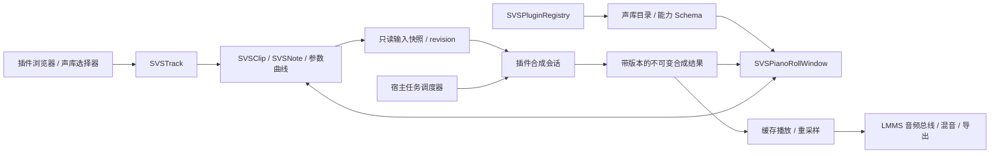

# SVS轨道 / SVS插件 / SVS钢琴窗支持计划书

日期：2026-10-03  
状态：执行中；M0→M3 已通过该阶段自动验证，M4→M5 尚未完成。
目标项目：当前 LMMS 工作区；行为参考 `tl_ref`，界面融入 LMMS Qt Widgets 与主题 CSS。

## 1. 目标与交付边界

新增独立轨道类型 **SVS**（Singing Voice Synthesis），提供从选择声库、输入歌词、编辑音符与参数，到异步合成、工程播放和导出的完整工作流。插件浏览器新增分类 **Singing Voice Synthesis**，同时公开可供第三方独立开发的 SVS SDK。

必须交付：

- SVS 轨道、SVS 片段与 SVS 钢琴窗；轨道默认名称为声库名，默认图标为声库头像。
- 基于插件和所选声库能力生成参数面板、曲线列表、语言选项、字典与音素编辑功能。
- 歌词、候选读音、音素、延音、用户音高曲线与合成音高回显。
- 钢琴窗显示声库立绘，支持显示开关、透明度调节和设置持久化。
- 覆盖本版全部能力的示例插件、示例声库、SDK 文档和兼容性测试材料。
- 接入 LMMS 混音、静音/独奏、撤销重做、工程保存与恢复、离线导出和主题 CSS。

本阶段不承诺直接运行 TuneLab .NET 插件，也不承诺任何特定商业引擎、模型格式或跨架构 DLL 兼容。参考其数据与交互逻辑，提供原生 LMMS 接口；后续适配器使用同一公开 API。示例合成器用于功能验证，不作为真实歌声质量指标。

## 2. 已核实的项目入口与参考依据

以下为本次 CodeGraph 定位和源代码查阅所得；后续新增类、方法和目录均为设计提案。

| 现有入口 | 已确认事实 | 本计划的接入方式 |
| --- | --- | --- |
| `include/Track.h`、`src/core/Track.cpp` | `Track::Type` 区分轨道；`Track::create` 按类型创建；工程 XML 将类型保存为整数 | 追加 SVS 类型，保留现有枚举数值；补齐创建、保存、加载、复制路径 |
| `src/tracks/InstrumentTrack.cpp` | 乐器轨组合音量、声像、静音、混音通道与 `AudioBusHandle` | 参考轨道体验和音频总线接法，不把 SVS 强行塞进逐 MIDI 音符合成流程 |
| `include/Plugin.h` | 插件有类型、描述符及子插件 key；尚无 SVS 类型 | 添加 SVS 分类与宿主适配层，独立定义公开 SVS ABI |
| `src/gui/PluginBrowser.cpp` | 现有插件浏览入口 | 新增分类、声库列表和 SVS 拖放入口；实施时精查过滤与拖放调用链 |
| `include/PianoRoll.h`、`src/gui/editors/PianoRoll.cpp` | 钢琴窗绑定 `MidiClip`，提供量化、缩放、选区、时间线与音符参数编辑 | 新增独立 SVS 钢琴窗，按小步提取共享交互，不直接将 SVS 片段强转为 MIDI 片段 |
| `src/gui/LmmsStyle.cpp` | 从 `resources:style.css` 加载样式，并监听文件修改重载 | 沿用主题加载与热更新；自绘 SVS 内容显式读取样式属性 |
| `data/themes/default/style.css` | 默认主题文件存在 | 增加 SVS 样式段，并为缺少新键的旧主题提供回退 |
| `tl_ref/TuneLab.SDK/Voice/IVoiceSynthesisEngine.cs` | 声库目录、会话创建、上下文驱动的参数/属性声明、只读回显声明分离 | 采用目录—能力声明—合成会话分层，以及稳定 ID 的声明差异更新 |
| `tl_ref/TuneLab.SDK/Voice/IVoiceSynthesisSession.cs` | 会话拥有分片与失效语义；宿主调度；支持取消、音高/音素/参数回显与状态 | 采用插件负责语义、宿主负责资源预算和发布检查的分工 |
| `tl_ref/TuneLab.SDK/Voice/VoiceSourceInfo.cs` | 当前目录元数据包含 Name、Description、可选 Portrait | 头像、语言列表、版本等作为 LMMS SVS 的明确扩展，不假设参考接口已经具备 |
| `tl_ref/TuneLab/Utils/LyricUtils.cs` | 歌词分词、汉字拼音和假名罗马字候选处理 | 参考候选交互；实际字典/音素策略由声库能力决定，不在宿主写死语言判断 |

用户参考图 1 用于歌词与读音双层显示、音高叠加、音素/波形条、底部参数轨及右侧立绘；参考图 2 用于 LMMS 原生工具栏、键盘、量化、缩放和滚动习惯。颜色、字体、控件尺寸服从当前 LMMS 主题，不照搬参考图的固定配色。参考截图中的人物图像仅用于布局说明；示例包使用自行提供且可分发的资源。

## 3. 核心架构与职责



| 模块（拟新增） | 职责 |
| --- | --- |
| `SVSTrack` / `SVSTrackView` | 声库绑定、默认命名与头像、混音控制、片段容器、轨道状态 |
| `SVSClip` / `SVSNote` | 音符、歌词、读音覆盖、音素覆盖、参数与曲线等用户数据 |
| `SVSPluginRegistry` | 扫描与校验插件、版本协商、目录缓存、创建引擎实例 |
| `SVSCapabilityModel` | 生成有效能力快照；差异更新控件；保留暂时隐藏的用户数据 |
| `SVSSynthesisScheduler` | 合成优先级、并发预算、取消、完成检查和导出等待 |
| `SVSPlaybackHandle` | 只读取已发布音频块，完成播放定位、重采样与总线输出 |
| `SVSPianoRollWindow` | 音符/歌词、读音与音素编辑、动态参数轨、立绘和状态展示 |

`SVSTrack` 继承 `Track`，以组合方式复用轨道控制与音频总线。避免直接继承 `InstrumentTrack` 携带琶音、和弦堆叠和 MIDI Port 等不匹配的语义。第一版限定 Song Editor 中的 SVS 轨；Pattern Store 的添加入口与拖放明确拒绝，避免默认创建循环片段时出现半支持状态。

第一版一轨绑定一个声库，所有片段继承该绑定；换声库作用于整轨并作为一次可撤销操作。后续需要片段级声库覆盖时再扩展，避免首版轨道头像与实际发声声库不一致。

## 4. SVS 轨道行为

1. “添加轨道”新增 `SVS`；拖入 SVS 声库到空白编曲区创建该轨，拖到已有 SVS 轨则进行声库替换。
2. 浏览器严格按插件类型路由，不将 SVS 拖放误走普通 Instrument 加载路径。
3. 选择声库后，默认图标使用 `avatar`，默认轨道名使用 `displayName`。未选声库时名称为 `SVS`，图标为主题提供的 SVS 占位图标。
4. 维护 `nameMode = followVoice | custom`：用户改名后，换声库保留自定义名称；提供“恢复声库名”操作。图标默认始终随声库变化；缺失或损坏头像回退 SVS 图标。
5. 提供音量、声像、静音、独奏、混音通道、效果链入口和声库选择入口。声音进入 LMMS 正常混音链，实时播放与导出共用相同增益及路由语义。
6. 片段双击打开 SVS 钢琴窗；片段预览绘制音符及合成状态，不以“已有波形”作为可编辑前提。
7. 插件/声库丢失时保留片段和全部用户数据，显示可重绑定的缺失状态。缓存有效时可播放并注明缓存状态；没有有效缓存时输出静音。
8. 轨道复制、片段复制生成新的实体 ID，保留参数与歌词；缓存只按内容复用，不复用旧会话或裸指针。

### 4.1 编曲轨道中的音符序列总览与片段操作（首版必需）

SVS 轨道在 Song Editor 内与乐器轨道保持相同的编曲体验：每个 SVS 片段内部显示音符序列缩略总览，横向位置和宽度对应音符时间与时长，纵向位置对应音高。总览直接读取用户音符数据，未合成、合成失败或插件缺失时仍可显示；合成状态作为附加标记，不能用波形替代音符序列。总览随片段内容、轨道缩放和裁剪范围实时更新，绘制裁剪在片段矩形内。

片段支持选择/多选、拖动、切片（在时间轴位置切分）、复制、粘贴、删除及撤销/重做；右键菜单和快捷键沿用 LMMS 的编曲操作习惯。复制为独立副本，修改或删除副本不改变原片段；删除同时取消所属合成任务，迟到结果不能恢复已删除片段。

切片位置以工程 tick 为准，按当前吸附设置确定。切分后左右片段在原时间轴上首尾相接，音符、歌词、手动音素、音高线与参数曲线按各自新片段的局部时间重新定位。跨切点音符按第 5 节的规则拆分；曲线在切点保留求值和切线边界信息，左右拼接时不因局部时间归零而跳变。切片会触发必要的重新解析与合成，不能承诺两个独立会话与原连续乐句的音频逐样本一致，但必须保持编辑数据和时间位置正确。

### 4.2 复制/粘贴后的时间轴匹配

复制/粘贴必须移动实际内容和播放时间，不能只移动片段外框或音符缩略图。统一使用以下时间关系：

```text
工程时间 tick = 片段起点 tick + 内容局部 tick - 片段内容偏移 tick
```

音符、歌词所附着的音符、手动音素、音高线、参数曲线和预览共用这套映射。秒制合成结果先映射到内容时间，再按目标位置与当前 tempo 转换；不得沿用原片段的绝对秒起点。

- 单片段粘贴以目标插入点为新起点；键盘粘贴使用编曲插入游标，右键粘贴使用右键定位的时间点，应用当前吸附规则并显示落点。
- 多片段复制以所选片段的最早起点为锚点，粘贴时整体平移，保留片段之间的相对间隔及可映射的轨道关系；不把每个片段都堆到同一时间点。
- 普通复制保留片段长度、内容偏移和局部数据；新起点相对原起点的差值只应用一次，避免音符被重复平移。有前导音素或尾音时，其相对位置也需正确跟随。
- 跨 SVS 轨粘贴按目标轨声库绑定工作；保留来源参数 ID 与未匹配数据，能力不兼容时显示诊断并重新解析/合成。普通乐器轨不直接接收 SVS 片段；未来如需转换，使用显式转换入口。
- 副本分配新的片段/音符 ID 和会话 generation。缓存只有在目标时间、tempo、声库及输入上下文满足一致性条件时才复用；否则重新合成。音频、音素、曲线回显必须发布到副本当前的时间位置。

专项验收：在第 2 小节创建含跨小节音符、歌词、手动音素和连续曲线的片段，复制并粘贴到第 6 小节；总览、钢琴窗时间标尺、播放指针、实际声音及导出均在第 6 小节对应位置出现，原片段仍在第 2 小节。再验证带内容偏移的片段、多片段相对间隔、目标位置 tempo 不同、切片后复制、删除副本与撤销、保存重开，排除内容仍在旧位置或被平移两次的问题。

## 5. 数据模型与工程持久化

| 对象 | 必需数据 |
| --- | --- |
| 轨道绑定 | `pluginId`、`voiceId`、插件/声库版本、默认语言、命名模式、混音设置 |
| SVS 片段 | 稳定 ID、起点/长度/偏移、音符集合、片段参数、可编辑曲线、字典绑定、Schema 版本 |
| SVS 音符 | 稳定 ID、片段内 tick 起点/时长、音高、原始歌词、可选语言覆盖、读音覆盖、手动音素与属性 |
| 曲线 | 命名空间参数 ID、单位、控制点、插值方式、显式断段、作用域 |
| 派生结果 | 输入 revision、缓存 key、音频块、音高、音素、只读参数、错误与进度 |
| 界面状态 | 立绘开关/透明度、参数轨显隐与高度、缩放、滚动位置 |

编辑时间使用 LMMS tick，合成快照另外提供由宿主统一转换的秒和 tempo 信息；不可假设固定 BPM。结果声明全局秒起点、采样率、通道数及样本长度，宿主集中重采样。曲线中的“未覆盖”使用显式可选值/断段，序列化不依赖非标准 JSON NaN。

XML 新增版本化 SVS 节点；保留现有轨道枚举数值，追加 SVS 并审计 `Count`、类型数组和所有 switch。旧工程在新版本中正常加载；新增 SVS 工程由不支持它的旧版本打开可能丢失轨道，不能承诺向旧程序无损回写。新版本遇到未知 SVS 字段/参数应原样保留，迁移失败时保留原始节点并提示。

用户编辑数据是权威数据，合成音频是可重建缓存；不把大块音频直接写入每次撤销快照。缓存损坏不阻止工程打开。资源保存稳定 ID 和可解析的包内相对路径，不将开发机器绝对路径作为唯一引用。

撤销检查点覆盖换声库、批量歌词、音素拖动、曲线绘制、片段切分/合并；连续拖动合并为一次操作。切分跨界音符时明确延音与音素归属，初版采用生成两个可编辑音符并由插件重新解析，保留原操作完整撤销能力。

## 6. 能力驱动的参数与 UI

有效能力由插件基础声明、声库声明和当前编辑上下文生成。宿主只展示已声明且当前可用的能力，不根据插件名猜测支持的参数。

### 6.1 参数描述 Schema

每个参数包含：稳定 `id`、显示名/翻译键、分组与顺序、类型、默认值、单位、数值范围、步长/标度、枚举值、作用域、读写属性、是否支持曲线、插值模式、可见/可用状态及禁用原因。作用域至少区分 track、clip、note、phoneme；曲线首版位于片段时间域。

支持 float/int/bool/enum/string；资源选择器使用受约束的资源 ID。值域、默认值和标度必须校验，拒绝重复 ID、非法范围和非有限数值。枚举保存稳定值，不能保存下拉框索引。对数标度要求合法正值范围；离散参数只能按声明的离散规则求值。

Schema 查询在提交编辑后执行，要求轻量、无副作用；昂贵模型探测提前异步完成。按 ID 更新控件，保留焦点和未完成输入。模式切换后隐藏的参数及曲线不删除；重新出现后恢复原值。参数多选支持一致值、混合值和未设置三态。

用户输入参数与合成回显分别声明、分别存储：回显曲线只读，不能通过同名 ID 覆盖用户曲线。气声、张力、性别、力度等只是示例参数；实际声库没有声明时不出现。

### 6.2 能力协商

| 能力 | 声明信息 | 缺失时行为 |
| --- | --- | --- |
| 参数/曲线 | Schema、可写范围、插值 | 隐藏对应编辑入口 |
| 字典解析 | 字典 ID/版本/语言、解析器标识、候选支持 | 保留歌词，使用插件自有解析或提示需要手动读音 |
| 音素编辑 | 音素集、时长编辑、属性 Schema | 音素回显可只读；不提供无效拖动 |
| 音高 | 用户音高输入模式、合成音高回显 | 支持哪个显示哪个；不要把回显误当可编辑输入 |
| 多语言 | 语言 ID、默认语言、是否允许逐音符覆盖 | 单语言声库固定语言；拒绝不支持的语言覆盖 |
| 图像 | avatar、portrait 资源描述 | 分别回退图标与无立绘 |
| 合成 | 分段支持、取消、并发约束、输出格式 | 可退化为整片段合成，仍保持宿主异步 |

能力增加无需改宿主硬编码参数列表；未知可选能力忽略，未知必需能力拒绝加载并说明版本要求。

## 7. 字典、歌词、音素与声库语言

声库元数据至少包含 `voiceId`、名称、描述、作者、版本、语言列表、默认语言、默认歌词、头像、立绘、可选音域和资源许可信息。语言使用稳定标签，界面显示本地化名称；显示语言与合成语言分开。

解析管线：原始歌词 → 按语言/插件规则分词 → 用户选择的读音或候选 → 字典/G2P → 音素序列 → 插件时长预测 → 合成。保存原始歌词，不用拼音或音素反向覆盖它。

优先级约定：手动音素覆盖 > 手动读音 > 工程自定义词条 > 声库字典 > 插件默认解析器。插件声明不支持某级时跳过并显示原因。字典结果包含候选、音素集 ID、词条来源和诊断；未知词保留原文并标记，不能无提示变成空字符串。

首版提供版本化 UTF-8 示例字典格式（JSON：语言、音素集、词条和候选），允许插件注册其他格式的解析器；不宣称所有声库字典格式通用。导入检查重复词条、编码、非法音素和缺失字段，返回可定位的错误。字典内容变更增加版本/哈希，使相关合成缓存失效。

批量歌词输入先预览分配结果，按选区音符时间顺序应用；处理词多于音符、词少于音符、标点、空白、多字节字符。多音字候选可选择，切换语言重新计算自动结果但保留手工覆盖并校验其兼容性。

延音语义由插件显式声明，不能由宿主一律将 `-` 当成有效延音。显示与合成使用同一判定；跨空隙、孤立延音、前导辅音、跨音符发音均要有示例。音素结果区分“尚未生成”“已生成但为空”“有结果”，避免把未知状态误当静音答案。

## 8. SVS 钢琴窗与立绘

布局建议：顶部保留 LMMS 传输、编辑工具、量化和缩放；左侧键盘；中央音符网格；右侧可收起的声库/语言/属性面板；底部为波形、音素条和可调整高度的动态参数区。

- 音符内部显示歌词，上方显示读音；短音符使用省略与悬浮详情，中文输入支持 IME。
- 提供绘制、框选、拖动、拉伸、复制、删除、吸附、批量移调和撤销重做；量化沿用 LMMS 时间习惯。
- 原始音符音高、用户音高曲线、合成音高分别显示；用户曲线的 absolute/offset 模式、单位及混合规则由能力声明明确，避免重复叠加。
- 音素条允许按能力调整边界、读音和属性；不支持时只读。波形和参数轨共享横向时间坐标。
- 播放使用工程传输状态；片段试听需明确的 SVS 播放上下文，不能直接调用只接受 MidiClip 的现有接口。
- 状态显示排队、合成中、可播放、已过期、取消、失败与重试；状态变化不打断编辑。

### 8.1 立绘显示与透明度（必需）

立绘来源为当前声库 `portrait`，默认锚定音符画布右下方，保持宽高比、限制在画布范围内，不随音符水平滚动漂移。绘制层次为背景/网格 → 立绘 → 音符/歌词/曲线/选区/播放指针；立绘不覆盖工具栏、键盘和参数控件。

提供“显示立绘”开关和 **0–100% 透明度**滑块/数值框：0% 完全不透明，100% 完全透明；内部换算 `opacity = 1 - transparency / 100`。拟默认透明度 70%，用户可实时调整并重置。文案统一使用透明度，避免把 opacity 百分比反向显示。

立绘层不接受鼠标事件，不影响点选、框选或曲线绘制。图像异步解码，按资源哈希和显示尺寸缓存，限制超大图片内存占用。支持透明背景 PNG；资源无效时隐藏并给出一次可查看诊断，编辑仍正常。

应用配置保存新工程默认值；工程内按 SVS 轨保存显式开关、透明度和显示位置设置。工程覆盖优先于全局默认；换声库替换图像但保留用户透明度。立绘显示变化不使音频缓存失效。

### 8.2 独立编辑器实现（硬性约束）

SVS 编辑器在独立代码模块实现，不继承普通 LMMS `PianoRoll` 的音符编辑、detuning 或自动化编辑逻辑。可组合使用 Qt 控件、LMMS 窗口外壳、传输接口、主题与快捷键服务；时间轴、命中测试、操作状态机、曲线求值和编辑事务由 SVS 自己管理。前文的“复用交互”指维持用户习惯与小型无状态工具，不意味着继承普通钢琴窗的数据边界。

**独立模块由 LMMS 显式引入，实际运行不依赖 `tl_ref`。** 建议设置独立内部构建目标并由 LMMS 链接/注册，公开 SDK 单独安装。`tl_ref` 仅用于开发阶段对照逻辑，不加入 include/link 路径、构建源文件、运行资源搜索路径或安装包；不要求 TuneLab、Avalonia 或 .NET 运行时。所需算法在 SVS 模块实现，示例字典、头像与立绘放入自己的插件包，不读取参考目录中的资源。模块独立并不要求另开应用窗口或独立进程，用户仍在 LMMS 内使用编辑器。

拟将编辑器代码集中为 `src/gui/editors/svs/`，包含窗口、画布、音符层、歌词层、音素层、音高层、参数层、立绘层及 `operations/`；前文单文件 `SVSPianoRoll.cpp` 路径由此模块布局取代。曲线模型与求值器放 `src/core/svs/`，不能依赖 GUI，绘制和合成必须使用同一求值规则。

进一步参考入口：`tl_ref/TuneLab/UI/MainWindow/Editor/PianoWindow/PianoScrollView/PianoScrollViewOperation.cs` 的音符移动、起止拉伸和音高绘制操作；`tl_ref/TuneLab/UI/LyricInput/LyricInput.axaml.cs` 的批量歌词与跳过延音；`tl_ref/TuneLab/UI/MainWindow/Editor/PianoWindow/ParameterArea/AutomationRenderer.cs` 及 `AutomationRendererOperation.cs`、`AutomationRendererPiecewiseOperation.cs` 的自由绘制、清除、锚点选择/移动/删除、分段曲线及音素属性操作。采用其操作分层思想，Qt 侧重新实现；具体键位在 M0 对照参考行为后形成映射表。

### 8.3 编辑操作规格

| 对象 | 必需操作与语义 |
| --- | --- |
| 音符 | 新建、框选/多选、整体移动、左右边缘拉伸、复制粘贴、切分、删除、移调；吸附只约束用户选择的时间网格，不限制音符跨小节 |
| 歌词 | 音符内直接编辑、前后音符导航、批量填词预览、候选读音选择、跳过延音；IME 组合输入期间不提交半成品，确认后一次撤销 |
| 音素 | 选择音素、替换符号、调整可编辑边界、编辑属性、恢复自动结果；前导辅音可位于音符起点之前，不按音符矩形硬裁剪；合法相邻边界由插件约束 |
| 音高线 | 自由笔、锚点、直线/平滑连接、框选移动、局部擦除/恢复自动、复制粘贴；用户层与合成回显层分离 |
| 参数曲线 | 按能力显示轨道；自由绘制、锚点增删与数值输入、框选、移动、局部清除、连接/断开、重置默认；连续和离散参数采用对应求值规则 |

用户执行补充（2026-10-05）：SVS 钢琴窗操作以 TuneLab 实际编辑逻辑为参考，仅对齐本节钢琴窗范围内操作；**工具切换也纳入实现与验收**，包括当前工具状态、切换后的鼠标语义/光标/命中优先级及未完成事务处理，不加入计划外工具或无关操作。实机对照记录见 `doc/svs/TuneLab-interactions.md`。

每个操作统一采用 begin/update/commit/cancel：拖动期间实时预览，松手合并提交一次，Esc 恢复原状态；鼠标捕获和边缘自动滚动允许一笔跨越当前视口。命中优先级为活动工具的锚点/手柄、可编辑对象、背景，立绘永不参与命中。

移动音符默认只移动音符及其从属歌词/手动音素，片段级曲线保持时间位置；提供“随选区移动曲线”显式选项。移动整个片段时音符与曲线整体平移；改变音符长度不隐式拉伸整条曲线。复制的时间选区若包含曲线，应携带边界插值信息以保持粘贴后的形状。

### 8.4 跨音符、跨小节平滑连接（首版必需）

音高线和连续参数曲线属于 **片段连续时间域**，不属于单个音符，也不按小节分桶。小节线只是网格标记，音符边界只是内容位置；两者都不能触发截断、自动补零、默认值重置或自动插入角点。曲线可穿过多个音符、音符间空隙和多个小节；空隙是否发声由声库决定，曲线本身保持完整。

曲线由有序实数 tick 锚点、值、段类型、切线/平滑模式及显式断段组成。内部保留分数 tick 精度，不能因为现有音符位置为整数 tick 而将音高笔触强制量化。连续参数支持线性与三次 Hermite 平滑，平滑连接至少保证函数值连续；选择平滑切线时保持一阶导数连续。参数值域采用受约束切线避免插值过冲，不能靠每帧硬截断造成平顶失真。阶梯型枚举/布尔参数按设计离散变化，不伪装成平滑数值曲线。

绝对音高采用连续半音值（小数表示音分），跨换音点不额外叠加音符阶跃。若插件仅支持相对音高，适配层用明确的基准曲线转换 `offset(t) = editedAbsolutePitch(t) - referencePitch(t)`，基准必须与插件契约一致；不能把同一偏移分别加到每个音符的恒定音高后宣称结果连续。能力不足时明确提示，不能只在画布画平滑线而向插件提交断裂数据。

只在用户主动断开、擦除产生未覆盖区或数据本身缺失时断线。“连接”操作显式填补选定间隙；合成回显中的无声/未知段保留断段，不自动用直线伪造发声。首版支持同一片段内任意跨音符和跨小节；跨两个独立片段的联动不作为隐含承诺，可先合并片段再编辑连续曲线。

播放/合成分块时以统一绝对时间求值，并向相邻块提供插值所需的上下文锚点/切线，不能在每个块起点重新初始化曲线。分块不能改变同一时间位置的求值结果。导出、波形预览和后台合成采用同一份曲线快照；tempo 改变仅影响 tick 到秒映射，不因小节换算引入断点。

专项验收：构造跨三个小节、至少四个不同音高音符及一个休止间隙的片段，一笔画连续滑音和气声曲线；核对每个音符边界、小节边界及合成块边界左右值一致，平滑模式下切线连续。再执行缩放、滚动、移动片段、变速、撤销、保存重开与离线导出，曲线保持相同形状和语义；明确断段保持断段。分别验证绘制结果、求值结果和插件收到的数据，而不只比较截图。

## 9. 接入 LMMS 主题 CSS

使用现有 `resources:style.css` 加载和热重载机制，不增加独立皮肤系统。新增控件遵循 Qt 样式选择器和 `Q_PROPERTY`；自绘画布从样式属性读取颜色，不能认为给 QWidget 写 background 就能自动改变 QPainter 的网格和曲线。

拟为 `SVSPianoRoll` 暴露网格/背景、普通/选中音符、歌词/读音、用户/合成音高、波形/音素、失效/合成/错误状态等属性；为轨道头像、参数轨标题和声库面板设置稳定对象名。下面仅为计划中的 QSS 示例，属性需在实现中注册后才生效：

```css
/* 写入当前主题 style.css；实际默认颜色跟随 LMMS 主题调整 */
lmms--gui--SVSPianoRoll {
    qproperty-noteColor: #65b86b;
    qproperty-lyricColor: #eeeeee;
    qproperty-synthesizedPitchColor: #b0c8e0;
    qproperty-gridLineColor: #303830;
}
QWidget#svsVoicePanel {
    background-color: palette(window);
    color: palette(window-text);
}
```

旧主题缺少属性时从 QPalette/现有钢琴窗语义颜色回退。主题重载触发 SVS 控件重新 polish、清除绘制缓存并重绘；不能只更新标准按钮。立绘透明度属于用户偏好，不由主题热重载覆写。参数推荐色仅作为提示，主题可覆盖，并保证文字、曲线与背景可辨识。

验收覆盖默认主题、浅色主题、缺少 SVS 样式的旧主题、运行时修改 CSS，以及 100%/150%/200% DPI；头像与立绘均不拉伸变形。

## 10. 合成、调度与播放

插件拥有发音、分段和内部失效依赖知识；宿主拥有全局并发预算、任务优先级、工程生命周期、音频输出和结果发布门禁。首版允许插件将整片段声明为一个合成块，之后无需修改宿主即可细化分段。

编辑提交生成不可变快照及单调 revision。快照包括声库/插件版本、音符与歌词、语言、字典版本、参数/曲线、tempo、片段位置。插件后台合成，只能访问快照，不能持有 GUI 或可变工程对象。

任务完成必须检查 clip ID、session generation、revision 和请求 ID；轨道删除、换声库、撤销或再次编辑后返回的旧结果直接丢弃。音频、音高、音素和参数回显作为同一版本结果原子发布，防止波形和歌词错位。

状态机：`Dirty → Queued → Rendering → Ready`，失败进入 `Failed`；取消后的过期任务不能恢复 Ready。取消只表示请求，直到任务真正结束才释放并发名额。能力声明不允许并发的引擎按引擎实例串行调度。

音频回调不进行模型推理、磁盘读取、字典解析、等待任务或大内存分配；只读已准备的不可变音频块。缺失/过期区域默认静音并显示状态，不无声替换成旧歌词音频。片段移动、变速、循环、跳转、裁剪和尾音按统一时间映射处理。

缓存 key 纳入完整合成相关输入、插件/声库/字典版本和输出格式；立绘、主题、窗口缩放不参与。采用有上限的内存/磁盘缓存，损坏块可重建。内容未变的块可复用，但发布仍需绑定当前请求版本。

离线导出先冻结工程快照，等待所有需要的 SVS 区域完成再走混音导出；任一区域失败默认终止并定位原因。用户如选择忽略失败区域则明确以静音输出。导出取消传递给任务，不留下无限运行作业。

## 11. 开放 SVS 插件 API

公开 SDK 与宿主内部 Qt/C++ 类解耦。建议采用 **带版本协商的 C ABI + C++ 便利封装**：固定宽度类型、不透明句柄、函数表、UTF-8 字符串；公共边界不传 QObject、QString、STL 容器或 C++ 异常。无需编译 LMMS 源码即可使用 SDK 开发示例插件。

首版公开契约至少包括：

| 接口族（拟定名称） | 内容 |
| --- | --- |
| `svs_get_api` | ABI major/minor、结构体大小、可选函数指针和特性位协商 |
| Engine | 初始化/销毁、声库目录快照、能力和参数 Schema 查询 |
| Resource | 头像/立绘资源查询、内容类型/大小/哈希、读取与释放 |
| Pronunciation | 字典枚举、候选查询、语言与音素校验、解析诊断 |
| Session | 创建/销毁、提交输入快照、查询待合成范围、开始/取消任务 |
| Result | 音频块、音素、音高、参数回显、进度与带上下文的错误 |
| Host services | 日志、任务完成投递、资源/音频缓冲分配与释放 |

ABI major 不兼容时拒绝加载；minor 采用尾部扩展和结构体 size 检查，未知可选字段忽略。每块内存定义所有者、有效期和对应释放函数，禁止跨模块分配/释放器混用。销毁前必须取消并等待该实例任务与回调退出；不得先卸载 DLL 再执行其回调。

声明调用在宿主数据线程串行完成；合成任务在后台；回调投递到受控队列，不直接操作 UI；音频线程从不调用通用插件 API。错误返回稳定代码、可读信息及 clip/note/参数定位，不跨 ABI 抛异常。

插件包清单包含 ID、版本、分类、API 版本、平台/架构、入口库、资源和作者信息。分类显示名固定为 `Singing Voice Synthesis`。资源解析限制在声明的包目录/宿主资源句柄内，校验尺寸和格式。扫描失败隔离到该插件，不阻止其他插件枚举。

原生插件首版可进程内运行；明确不能保证隔离 native crash，API 应保留后续进程桥接所需的值类型消息边界。首版要求插件与宿主位数匹配，不把 Qt6、Windows SDK 或 Libjack 当作 SVS 插件的必需运行依赖。

SDK 交付：公共头文件、CMake 示例、包清单规范、最小/完整示例、参数与字典格式说明、生命周期/线程文档、版本兼容指南、错误码和一致性验证工具。现有 `Plugin::Descriptor` 通过内部适配层进入浏览器；扩展类型值时保持旧类型值，避免公开 SDK 直接继承现有不稳定内部 ABI。

## 12. 全能力示例插件

拟新增 `SVSExample`，提供可确定复现的简单合成音频，不依赖在线服务或大型模型。覆盖的是“本版 SDK 定义的全部能力”，不是所有真实引擎可能存在的能力。

- 至少两个示例声库：全能力多语言声库、用于降级验证的精简声库；各有独立稳定 ID、名称、头像与立绘。
- 全能力配置包含浮点/整数/布尔/枚举/字符串参数，片段/音符/音素属性，连续/离散曲线，条件显隐和只读回显。
- 提供中文、日文、英文小型演示字典与候选案例；明确只是固定测试词条，不声称具有完整语言覆盖。
- 返回音频、音高、音素、参数回显和分段进度；输入参数应实际改变演示输出，不能只声明空能力。
- 覆盖延音、未知词、用户读音、音素覆盖、不同采样率、缺失图片、部分能力与失败重试。
- 开发模式提供延迟、取消后晚返回、失败、非法 Schema 等可控故障开关，用于验证宿主门禁。
- 携带演示工程，包含多轨混音、参数曲线、语言切换和立绘透明度；示例资源可离线分发。

## 13. 实施顺序与里程碑

| 阶段 | 交付 | 完成门槛 |
| --- | --- | --- |
| M0：契约与接入核查 | 冻结 v0.1 数据格式/ABI 草案；精查轨道类型分支、播放/导出、主题属性、CMake 入口 | 枚举兼容、线程/内存所有权、时间域、音素覆盖语义明确；形成变更清单 |
| M1：可运行纵向切片 | SVS 类型、分类、声库选择、名称/头像、片段保存、最小示例合成与混音播放 | 新建→选声库→放音符→合成→播放→保存重开可用 |
| M2：能力与字典 | 动态参数 Schema、多语言、候选读音、字典、音素属性、全能力示例 | 切模式/声库不丢用户数据；参数改变实际输出；缺失能力正确降级 |
| M3：钢琴窗与主题 | 独立 SVS 编辑器；音符/歌词/音素/音高/波形/参数轨、立绘开关与透明度、CSS | 跨音符/跨小节平滑连接及插件输入一致性通过；参考交互、主题热更和 DPI 检查通过 |
| M4：生命周期与导出 | 任务取消、缓存、旧结果拒收、tempo/定位、工程迁移、导出等待 | 编辑竞态、删除轨道、换声库及导出失败不产生错播或崩溃 |
| M5：SDK 发布准备 | 外部构建示例、API 文档、演示工程、回归与性能记录 | 示例只依赖 SDK 即可构建；全能力及精简配置通过验收 |

建议文件归属：现有 `include/Track.h`、`src/core/Track.cpp`、`include/Plugin.h`、`src/gui/PluginBrowser.cpp` 负责注册；新增 `include/SVS*.h`、`src/tracks/SVSTrack.cpp`、`src/core/svs/`、`src/gui/editors/SVSPianoRoll.cpp` 和相关视图；公开 SDK 放 `sdk/svs/`，示例放 `plugins/SVSExample/`。这些路径是建议，M0 核对仓库构建组织后落地，不能仅添加源码而漏掉安装与打包规则。

首轮实现从 M0/M1 开始，不先重构整个普通 PianoRoll。只有在 SVS 的可运行路径成立后，才抽取有明确共享收益的网格坐标、量化和选区工具。

## 14. 验收与回归清单

| 范围 | 必测结果 |
| --- | --- |
| 轨道 | 分类名称准确；声库头像/名称默认正确；改名后换声库不覆盖自定义名；静音/独奏/声像/效果/混音路由有效 |
| 编曲片段 | 乐器轨式音符序列总览；切片/复制/粘贴/删除及撤销可用；粘贴后的音符、音素、曲线、播放和导出匹配目标时间轴，多片段保持相对间隔 |
| 工程 | 保存重开、复制、撤销/重做保留所有用户输入；旧工程正常；插件缺失仍可编辑且不丢未知参数 |
| 参数 | 范围、离散值、默认值、枚举 ID、条件显隐、多选混合态正确；只读回显不能误编辑 |
| 字典语言 | 候选多音字、假名、英文词条、未知词、错误字典、切换语言、延音和手工音素覆盖行为可解释 |
| 钢琴窗 | 独立编辑实现；量化、缩放、滚动、歌词 IME、音素边界、曲线时间对齐与撤销一致；连续音高/参数跨音符、跨小节、跨合成块不被截断 |
| 立绘 | 显隐和 0/50/100% 透明度正确；换声库、保存重开后恢复；不抢鼠标；损坏/缺失资源不影响编辑 |
| 主题 | 默认/浅色/旧主题及热重载均改变自绘内容；高 DPI 清晰、无固定参考图配色残留 |
| 调度 | 快速连改、取消晚返回、删除片段、换声库、关闭工程均不能发布旧结果；并发预算真实有效 |
| 音频 | 变速、移动片段、循环、跳转、重采样、尾音与多轨混音对齐；未就绪区域静音且状态明确 |
| 导出 | 等待有效版本，错误区域可定位，取消可结束；成功导出与相同工程的缓存播放一致 |
| SDK | 错误 ABI、重复 ID、非法 Schema、架构不匹配得到清晰诊断；外部示例无需 LMMS 内部头文件 |
| 独立性 | 在不包含 `tl_ref` 的干净源码副本中构建；安装包在无 TuneLab/.NET 的目标环境打开演示工程，完成编辑、立绘显示、合成与导出；构建和运行资源均无参考目录路径 |

性能验收用固定演示工程记录基线：多轨合成时持续拖动音符无明显停顿；音频回调无合成/磁盘/任务等待；长工程曲线按可见区域绘制，波形分层采样；图像与音频缓存均有上限。M0 确定测试机器与数据规模，再设可复验阈值，不能用示例合成器速度宣称真实模型性能。

后续任何配置、编译、打包、测试均依照本项目规则，在前台 PowerShell 输出并记录日志；不后台构建。每一步独立检查退出码，失败立即读取对应日志。示例（构建目录须先按本机实际配置确定）：

```powershell
& cmake --build build --config Debug 2>&1 | Tee-Object -FilePath "build.log" -Encoding utf8
$buildExitCode = $LASTEXITCODE
if ($buildExitCode -ne 0) {
    Get-Content -LiteralPath "build.log" -Tail 160
    exit $buildExitCode
}
```

配置和测试命令同样使用该管线；下一步覆盖 `build.log` 前保存上一阶段日志。Windows 环境以用户提供的 Qt6 `C:\Qt\6.10.3`、Windows SDK `D:\Windows Kits\10` 为核查起点，具体工具链、Qt kit 与构建目录由实施时确认。本文为计划书交付，未执行编译、测试或声库接入。

## 15. 完成定义

用户能在 **Singing Voice Synthesis** 分类选择示例声库，得到默认头像和声库名称的 **SVS** 轨道；双击片段后编辑歌词、音符及插件声明的参数，查看音素、合成音高与波形；钢琴窗立绘可以显隐并调整透明度，设置可恢复；全流程使用 LMMS 主题 CSS，能播放、混音、保存重开和导出。第三方开发者可以仅凭公开 SDK 和示例实现新 SVS 插件，无需修改宿主参数列表。

## 16. 执行进度（2026-10-05）

| 阶段 | 状态 | 证据与剩余验收 |
| --- | --- | --- |
| M0 | PASS | `doc/svs/M0-contract.md` 冻结 v0.1 数据/ABI/时间/所有权/交互/接入清单和性能数据集；`tests/svs/M0ContractTest.py` 通过；日志 `doc/svs/validation/M0.log`。TuneLab 本机交互复核 MANUAL/PENDING，不阻塞 M1。 |
| M1 | PASS | 原生 SVS 轨道/片段、独立钢琴窗最小音符输入、SDK C ABI、SVSExample、异步 PCM 合成及 LMMS 混音已接通。Release 主程序/示例/集成测试编译通过；QtTest 验证鼠标创建、合成、混音、声库换名、XML 恢复、复制 ID/移动和通道路由；日志 `doc/svs/validation/M1-build.log`、`M1-test.log`、`M1-enum-regression.log`。开发版实机主题/图标/独立配置启动通过；听感验收 MANUAL/PENDING，完整编辑/调度验收归 M3/M4。 |
| M2 | PASS | 五类参数/四作用域、受约束资源 ID、Schema 校验、控件 ID/焦点保留、多选三态、只读回显、条件显隐、异步声明重查及持久化已接通；三语言字典/候选/覆盖优先级/诊断及插件解析已验证。完整→精简→完整声库切换保留输入，缺失能力拒绝编辑，Gain 实际 PCM 能量按比例变化。Release 编译及 6 个 QtTest 槽通过；证据 `doc/svs/M2-capabilities.md`、`doc/svs/validation/M2-build.log`、`M2-test.log`、`M2-QtTest.txt`。音符/音素选择和候选菜单等完整交互在 M3 接入，听感验收 MANUAL/PENDING 不阻塞。 |
| M3 | PASS | 独立编辑器及工具切换、连续音高/参数曲线、歌词/读音/延音链、音素/波形条、异步头像/立绘、持久化与主题回退完成；实际插件输入及 PCM、相对音高显式基准转换、单次撤销与操作门禁通过。Release 编译及 21 个 QtTest 槽通过；100%/150%/200% offscreen 主题/立绘检查通过。证据 `doc/svs/M3-editor-progress.md`、`doc/svs/validation/M3-final-build.log`、`M3-final-test.log`、`M3-final-QtTest.txt`。真实系统 IME、桌面主题/DPI 观感 MANUAL/PENDING，不阻塞 M4。 |
| M4 | PENDING | 生命周期、缓存、迁移、导出待实现 |
| M5 | PENDING | SDK 外部构建、演示工程、最终回归与独立性验证待执行 |

参考图已读取，实际布局按“布局和功能.png”、视觉按“配色和风格.png”及 LMMS 主题。已有 Song/VST 未提交修改保留，不纳入 SVS 里程碑提交。
