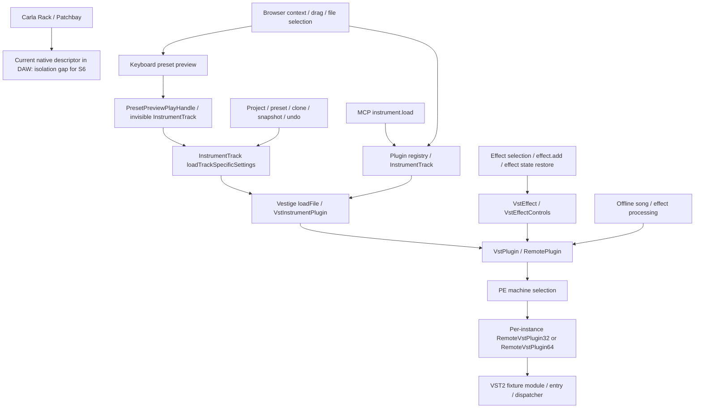

# Windows VST host contract, schema 1

Baseline: `dbf7500af67b11200f513bdc5c0b5e3a7ab2f0f9`. Plan: `VST3_SUPPORT_PLAN.md`.
Build scope: Windows x64 DAW, Windows x86 and x64 helpers. No other platform validation.

## Identity and location

An identity contains format (`vst2`/`vst3`), PE machine (`0x014c`/`0x8664`), and audio class ID.
VST3 component CID is 16 raw bytes (32 hex digits in JSON); controller CID is a separate field.
VST2 unique ID and optional shell ID are unsigned 32-bit integers. VST2 identity also includes
the original module binding, because unique IDs can collide. Names are display metadata.
Locator contains module/bundle path, actual binary path, version and SHA256 fingerprint.
Multiple locators remain candidates; root ordering never changes a saved version binding.

## IPC

`include/vsthost/Protocol.h` defines the byte encoding. Header is 40 bytes, little endian:

| Offset | Bytes | Value |
| --- | --- | --- |
| 0 | 4 | magic `0x48564d4c` |
| 4 | 2 | protocol version 1 |
| 6 | 2 | opcode |
| 8 | 8 | non-reusable session ID |
| 16 | 8 | generation |
| 24 | 8 | request sequence / audio block sequence |
| 32 | 4 | payload byte count, at most 16 MiB |
| 36 | 4 | reserved zero |

Strings: uint32 byte count followed by UTF-8 bytes. IDs, sizes and offsets have explicit
width; C++/Qt objects, native pointers and native struct layouts are never sent.
Shared regions are validated using subtraction, avoiding offset+size overflow.
Replies must match session, generation and request. Header decoding is independent of
payload framing; the transport must receive exactly the announced payload before dispatch.
Control, state and audio traffic use separate channels. Audio capacity is negotiated once;
no allocation, process start, state operation or control lock belongs in an audio callback.

## Lifecycle and faults

Stopped -> Starting -> Ready -> Processing -> Ready; any active state may fault.
Shutdown enters Stopping, then Stopped. Restart uses a new generation and discards old replies.
Defaults: startup/module scan 30 s; class/state 15 s; shutdown 2 s. A monotonic supervisor
enforces these deadlines independently of the plugin thread. Audio deadlines use block IDs.
Faults contain identity, locator, architecture, session, generation, stage, error code,
native exit code and log path. Instrument faults silence output. Effect fallback must be
explicit and latency matched. Export faults fail the render unless explicitly overridden.

## Bus, parameter and state persistence

Bus: direction, media (`audio`/`event`), stable index, channel arrangement, enabled flag and
LMMS routing endpoint. Main mono/stereo layouts are negotiated; extra outputs and sidechains
are explicit routes. Unconnected buses are disabled. Bridge plus processor latency feeds
actual route compensation, including parallel paths and offline leading/trailing samples.

Parameters: stable uint32 ParamID, normalized value, edit/read-only/bypass flags and display
metadata. Queues contain bounded, sorted block-relative sample offsets. VST2 indices remain
valid for old XML. UI edits return begin/perform/end events to LMMS without feedback loops.

Project state schema 1 stores identity, locator, buses, parameter bindings, component blob,
controller blob and their SHA256 checksums. Blob lengths are bounded by MaxControlBytes.
Restore component first, call controller setComponentState, then restore controller state.
Unknown or missing-plugin data is preserved byte-for-byte. Failed save preserves the prior
blob. State work runs behind an asynchronous processing barrier on the required helper thread.
Old VST2 `plugin`, `program`, `chunk`, `numparams`, `paramN` XML stays readable; `uservst:`
still resolves against the fixed old root, independent of scan-root ordering.

## Instantiation inventory and call paths

All rows require runtime third-party-module evidence; static discovery alone is insufficient.

| Entry | Existing path | Required isolation boundary |
| --- | --- | --- |
| Vestige file, drag, reload | VestigeInstrument::loadFile -> VstInstrumentPlugin -> VstPlugin::tryLoad | RemoteVstPlugin |
| Project/preset/clone instrument | InstrumentTrack/loadSettings -> VestigeInstrument::loadSettings -> loadFile | same |
| Effect selection/add/restore | Effect::instantiate -> VstEffect -> VstEffectControls::openPlugin -> VstPlugin | same |
| Browser preview/context/drag | FileBrowser -> registry / track load -> Vestige | same |
| Instrument window drop | InstrumentTrackWindow -> InstrumentTrack -> loadFile | same |
| MCP instrument load | CoreCommands::executeInstrumentLoad -> loadInstrument/loadFile | same |
| MCP effect add | CoreCommands::executeEffectAdd -> Effect::instantiate | same |
| Snapshot/undo/rollback | ProjectSnapshot / project restore -> instrument/effect loadSettings | same |
| Offline rendering | restored song -> track process / effect chain -> RemotePlugin::process | same |
| Carla Rack/Patchbay | CarlaInstrument -> native descriptor instantiate/activate/get_state | currently DAW; must move out in S6 |
| Plugin discovery | VstSubPluginFeatures::listSubPluginKeys -> recursive file list | no native scan currently; new scan helper |

`Vst2CompatibilityTest` records actual child PID, helper name and module path for both ABIs,
checks the fixture is absent from the parent, processes known samples and round-trips legacy
parameter/chunk state. MIDI sorting/sample offsets and native editor create/show/hide
checks pass on both ABIs.

`VstEntryPoints` loads the real Release vestige/vsteffect/vstbase DLLs, not substitutes.
Its executable is named lmms.exe because those native LMMS DLLs import that module.
It records parent/child PID, helper executable and fixture module path at the following
boundaries on both ABIs: instrument.load, reload/file loader, preset restoration,
track clone, instrument/clone/effect snapshot undo/redo, effect.add, project reopening,
frozen legacy project reopening, offline export, and actual browser keyboard preset preview.
Each active instance has its own child PID. The fixture is absent from the parent.
Project clearing and Engine shutdown leave no fixture-bearing child process.

Coverage boundaries: browser keyboard preview is exercised through the real widget;
file dialog, context and drag routes are mapped statically and exercised at their shared
registry/loadFile seam. These records establish the native instantiation boundary, not
end-to-end pointer gesture or file-dialog UI coverage; S5 must test its changed GUI routes.
Raw VST DLL clicks do not preview plugins in the baseline: FileBrowser explicitly excludes
FileType::VstPlugin from preset preview. A VST-backed .xpf does instantiate a preview plugin.
Preview tracks persist until Engine shutdown; the test must follow that lifecycle rather
than delete this global track while audio is running.

Carla baseline is BLOCKED_ENVIRONMENT for runtime native-module observation: the configured
backend is DummyCarla, which cannot load a VST. Its direct native call path and missing
packages are recorded; this is an S0 baseline finding and does not satisfy S6.
No VST3, fault supervision, latency compensation or real Carla success is claimed here.
Offline S0 checks validate RIFF/WAVE payload and nonzero audio; sample-exact timeline and
parallel latency comparisons belong to S5/S7, not this existing behavior baseline.

## Results

## S1 Windows transport implementation

RemotePlugin installs LegacyHostBridge for VST2; other remote clients retain their
existing transport. A session owns two named mappings and a per-instance Windows Job.
The helper starts suspended, joins the Job, then resumes. A separate watchdog enforces
control deadlines and consumes atomic audio-failure notifications. Restart increments
generation after stopping the old Job and quiescing the audio producer.

Control commands use an explicit u32 command count, then command ID, argument count,
and length-prefixed UTF-8 arguments. The complete packet is checked before allocation.
The control dispatcher owns request sequences and state pause/resume barriers. Native
VST calls and HWND message handling remain in RemoteVstPlugin32/64.

Audio uses three preallocated slots, up to 4096 frames, 32 channels and 16384 event
bytes. Ownership uses aligned Windows Interlocked words. One live callback submits
the current block and consumes only the preceding block; startup returns silence.
A missing result faults the instance immediately instead of waiting or replaying
late audio. MIDI ingress is a bounded 512-cell concurrent-producer queue. Parameters
and tempo use atomic publication. Audio records contain five little-endian u32 fields:
MIDI type/channel/data1/data2/sampleOffset; parameter type 256/channel zero/index/
float32 bits/offset zero; tempo type 257/channel zero/BPM/reserved zero/offset zero.
Offline rendering waits on the control dispatcher with an audio deadline and returns
the current block. Realtime rendering never invokes that waiting path.

S1 establishes transport isolation, deadlines and known-sample compatibility. Route
compensation for the live one-block delay, full offline timeline/tails, additional
bus routing and removal of control waits under LMMS model mutation locks remain S5.
Carla remains S6. The component/native fault tests do not establish the continuously
scheduled mixed 16-instance S7 matrix.

Allowed values: PASS, FAIL, SKIPPED_MANUAL, BLOCKED_ENVIRONMENT, NOT_RUN.
Listening, subjective GUI/DPI/focus checks, manual license activation and certification are
SKIPPED_MANUAL by user instruction. ARA and non-Windows builds are outside this task's scope.
Automated tests and environment failures never become PASS through this skip rule.
